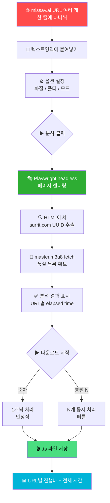
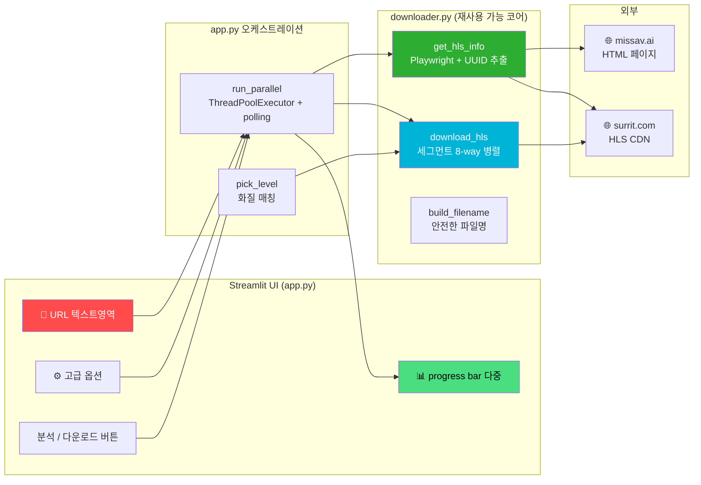
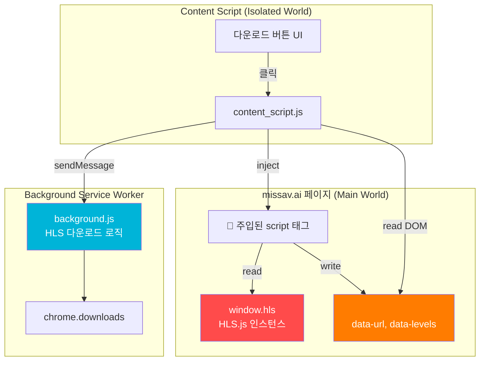
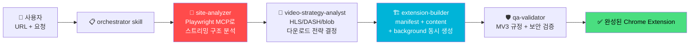

# 📼 crawl-video - HLS 영상 다운로더 & 익스텐션 자동 생성 하네스

<div align="center">

[](https://www.python.org)
[](https://streamlit.io)
[](https://playwright.dev)
[](https://developer.chrome.com/docs/extensions/mv3/intro/)
[](https://docs.anthropic.com/en/docs/claude-code)

> 🇺🇸 [English README](./README_EN.md)

**Playwright + Streamlit 로 HLS 스트림을 한 번에 일괄 다운로드. 분석/다운로드 분리 + 병렬 처리** ✨

[🎯 주요 기능](#-주요-기능) | [💻 로컬 실행](#-로컬에서-실행하기) | [🎮 사용 방법](#-사용-방법) | [🛠️ 하네스](#-하네스-claude-code-harness)

</div>

---

## 🎯 프로젝트 소개

**crawl-video**는 두 가지 산출물을 한 저장소에서 함께 관리하는 프로젝트입니다.

1. **🐍 `missav-dl/` — Python Streamlit HLS 다운로더 (메인 도구)**
   복수의 missav.ai URL을 입력해 한 번에 분석하고, 순차/병렬로 일괄 다운로드합니다. Playwright headless 브라우저로 페이지를 렌더링한 뒤 surrit.com UUID를 추출해 m3u8 master playlist를 fetch합니다.

2. **🔧 `extensions/missav/` — Chrome Extension (대안 구현, 참고용)**
   Manifest V3 기반의 익스텐션. Chrome content script `isolated world` 제약 때문에 `<script>` 태그 주입 브릿지로 `window.hls`에 접근합니다. Python 도구를 권장하지만 In-page 버튼이 필요할 때 유용합니다.

3. **🤖 `.claude/` — Claude Code Harness**
   Playwright MCP로 임의의 영상 사이트를 분석해 Chrome Extension을 자동 생성하는 다단계 에이전트 파이프라인. 새 사이트에 대응할 때 처음부터 다시 구현하지 않고 하네스를 통해 자동화합니다.

### ✨ 주요 기능

#### `missav-dl/` (Python Streamlit) — **권장**

- 📋 **다중 URL 일괄 처리** — 텍스트영역에 한 줄에 하나씩 입력
- 🔍 **분석/다운로드 2단계 분리** — 모든 URL을 먼저 분석 → 결과 확인 후 다운로드
- ⚙️ **고급 옵션** — `순차` / `병렬` 모드, 동시 처리 수 슬라이더 (1~5, 기본 2)
- 🎚️ **전역 선호 화질** — 한 번 선택하면 모든 URL에 자동 매칭 (없으면 가장 가까운 하위 화질)
- ⏱️ **URL별 + 전체 elapsed time 표시**
- 🛡️ **에러 격리** — 일부 URL이 실패해도 나머지는 계속 진행
- 📂 **로컬 폴더 직접 저장** — 메모리 제한 없이 큰 파일 처리

#### `extensions/missav/` (Chrome MV3)

- 🎥 **In-page 다운로드 버튼** — `.aspect-w-16` 플레이어 아래 자동 삽입
- 🪟 **팝업 UI** — 익스텐션 아이콘에서 빠른 접근
- 🌉 **Isolated world 우회 브릿지** — 메인 월드 `window.hls` → DOM `<meta>` 태그 → content script

#### `.claude/` (Harness)

- 🤖 **에이전트 4종**: site-analyzer, video-strategy-analyst, extension-builder, qa-validator
- 📚 **스킬 4종**: orchestrator, playwright-site-analyzer, video-download-strategy, chrome-extension-builder
- 🔄 **자동화된 파이프라인**: 사이트 분석 → 전략 수립 → 익스텐션 생성 → QA 검증

---

## 🎮 사용 방법



### 📝 단계별 가이드 (Streamlit UI)

| 단계 | 설명 |
|------|------|
| 1️⃣ 서버 시작 | `streamlit run app.py` 실행 후 `http://localhost:8501` 접속 |
| 2️⃣ URL 입력 | 텍스트영역에 missav.ai URL을 한 줄에 하나씩 (예: `https://missav.ai/ko/h_1724a141g00017`) |
| 3️⃣ 옵션 설정 | 저장 폴더 + 선호 화질(720p 기본) 선택. 필요하면 ⚙ 고급 옵션 펼쳐서 순차/병렬 모드 변경 |
| 4️⃣ 분석 | `분석 (N개)` 클릭 → URL별 결과 + 시간 확인 |
| 5️⃣ 다운로드 | `다운로드 시작 (M개)` 클릭 → URL별 진행바 + 완료 시 파일 크기/시간/세그먼트 수 |

### 🐳 (대안) Chrome Extension 사용법

```bash
# 1. chrome://extensions/ 에서 개발자 모드 ON
# 2. "압축해제된 확장 프로그램 로드" → crawl-video/extensions/missav/ext/ 선택
# 3. https://missav.ai/ko/<영상> 접속 → 플레이어 아래 다운로드 버튼 표시
```

---

## 🏗️ 기술 스택

<div align="center">

| 카테고리 | 기술 | 용도 |
|----------|------|------|
| UI | Streamlit 1.35+ | 일괄 다운로드 웹 UI |
| 페이지 렌더링 | Playwright (headless Chromium) | 봇 감지 우회 + JS 실행 |
| HTTP 클라이언트 | httpx | m3u8 / 세그먼트 fetch |
| 동시성 | ThreadPoolExecutor | 다중 URL + 세그먼트 병렬 처리 |
| 익스텐션 | Chrome Manifest V3 | In-page 다운로드 (대안) |
| 익스텐션 테스트 | Jest 29 | TDD 단위 테스트 |
| 하네스 | Claude Code Agents + Skills | 사이트 분석 자동화 |
| Python | 3.11+ | 런타임 |

</div>

### 🎨 아키텍처 — `missav-dl/`



### 🌉 Chrome Extension Isolated World 우회



---

## 📁 프로젝트 구조

```
crawl-video/
├── 📄 README.md
├── 📄 CLAUDE.md                       # 하네스 트리거 + 변경 이력
├── 📂 missav-dl/                      # 🐍 Python Streamlit 다운로더 (메인)
│   ├── 📄 requirements.txt            # playwright, httpx, streamlit
│   ├── 🔧 downloader.py               # get_hls_info / download_hls / build_filename
│   └── 🖥️ app.py                      # Streamlit UI + 다중 URL 오케스트레이션
├── 📂 extensions/missav/              # 🐳 Chrome Extension (대안)
│   ├── 📄 package.json                # Jest 설정
│   ├── 📂 ext/                        # ★ Chrome이 로드할 디렉토리
│   │   ├── 📄 manifest.json           # MV3 매니페스트
│   │   ├── 🎨 content_script.js       # In-page UI + main-world 브릿지
│   │   ├── ⚙️ background.js           # Service Worker (다운로드 로직)
│   │   ├── 🪟 popup.html / popup.js   # 팝업 UI
│   │   └── 📂 lib/
│   │       ├── 🧮 m3u8-parser.js      # 마스터/세그먼트 플레이리스트 파싱
│   │       └── 🛠️ download-utils.js   # 파일명/UUID 유틸
│   └── 📂 __tests__/                  # Jest 단위 테스트 (27 tests)
└── 📂 .claude/                        # 🤖 Claude Code 하네스
    ├── 📂 agents/                     # 4개 전문 에이전트
    │   ├── site-analyzer.md
    │   ├── video-strategy-analyst.md
    │   ├── extension-builder.md
    │   └── qa-validator.md
    └── 📂 skills/                     # 4개 도메인 스킬
        ├── video-downloader-extension-orchestrator/
        ├── playwright-site-analyzer/
        ├── video-download-strategy/
        └── chrome-extension-builder/
```

---

## 💻 로컬에서 실행하기

### 📋 사전 준비물

- Python 3.11 이상
- (선택) Chrome 111+ (익스텐션 사용 시)

### 🚀 실행 방법 — Python 다운로더 (권장)

```bash
# 1. 저장소 클론
git clone https://github.com/izowooi/creative-plate.git
cd creative-plate/crawl-video/missav-dl

# 2. 의존성 설치
pip install -r requirements.txt

# 3. Playwright Chromium 다운로드
playwright install chromium

# 4. Streamlit 실행
streamlit run app.py
# → 브라우저에서 http://localhost:8501 접속
```

### 🐳 실행 방법 — Chrome Extension (대안)

```bash
# 1. Jest 의존성 설치 (테스트 시에만 필요)
cd creative-plate/crawl-video/extensions/missav
npm install

# 2. 단위 테스트 실행 (27 tests)
npm test

# 3. Chrome에서 로드
# chrome://extensions/ → 개발자 모드 ON
# "압축해제된 확장 프로그램 로드" → extensions/missav/ext/ 디렉토리 선택
```

### ⚙️ Streamlit UI 옵션

| 옵션 | 기본값 | 설명 |
|------|--------|------|
| URL 목록 | — | 한 줄에 하나씩 입력 |
| 저장 폴더 | `~/Downloads` | `.ts` 파일이 저장될 로컬 경로 |
| 선호 화질 | `720p` | 모든 URL에 적용. 없으면 가장 가까운 하위 화질 |
| 실행 모드 | `병렬` | `순차` / `병렬` (고급 옵션) |
| 동시 처리 수 | `2` | 병렬 모드의 워커 수 (1~5, 고급 옵션) |

---

## 🛠️ 하네스 (Claude Code Harness)

`.claude/` 하위에 정의된 **video-downloader-extension-orchestrator** 스킬은 Playwright MCP를 사용해 임의의 영상 사이트를 분석하고 Chrome Extension을 자동 생성하는 메타 도구입니다.



**사용 예시:**

```
사용자: "https://example-video-site.com 분석해서 다운로드 익스텐션 만들어줘"
→ orchestrator skill 자동 발동
→ Playwright MCP로 사이트 분석 → 전략 → 익스텐션 생성 → QA
```

**구성:**

| 에이전트 | 역할 |
|----------|------|
| `site-analyzer` | 네트워크 요청 모니터링, 영상 URL 패턴 발견, 인증/DRM 감지 |
| `video-strategy-analyst` | HLS/DASH/직접URL/blob별 다운로드 전략, MV3 권한 명세 |
| `extension-builder` | 3개 역할(manifest/content/background)로 분기, 병렬 구현 |
| `qa-validator` | 코드 완결성, 보안, 권한 최소화, MV3 규정, 약관 위반 검사 |

---

## 🔬 사이트 분석 결과 (missav.ai)

| 항목 | 값 |
|------|-----|
| HLS URL 위치 | HTML에 `surrit.com/{UUID}/720p/video.m3u8` 직접 삽입 |
| URL 패턴 | `https://surrit.com/{UUID}/{quality}/video.m3u8` |
| 품질 | 360p / 480p / 720p / 1080p |
| 세그먼트 | `video{N}.jpeg` (실제 MPEG-TS, 첫 바이트 `0x47`) |
| 인증 | surrit.com은 `Referer: https://missav.ai/` 헤더 필요 |
| DRM / 암호화 | 없음 |

> 💡 헤드리스 환경에서 `window.hls`는 초기화되지 않지만, 서버가 HTML에 surrit URL을 직접 삽입하므로 정규식으로 추출 가능합니다.

---

## 🎯 향후 개선 사항

- [ ] **재시도 로직** — 세그먼트 다운로드 실패 시 자동 재시도 (현재는 단발성)
- [ ] **다른 사이트 어댑터** — 하네스를 통해 다른 미디어 사이트 어댑터 자동 생성
- [ ] **다운로드 일시정지/재개** — 큰 배치 작업 중간 제어
- [ ] **CLI 모드** — Streamlit 없이 명령줄로 일괄 처리 (`python -m missav_dl ...`)
- [ ] **자막 / 메타데이터 다운로드** — 영상 외 부가 정보 함께 저장

---

## 🤝 기여하기

1. Fork 후 브랜치 생성
2. 변경사항 커밋 (`git commit -m 'feat: 새 기능 추가'`)
3. 브랜치 Push (`git push origin feature/새기능`)
4. Pull Request 생성

---

## 📄 라이선스

MIT License — 자유롭게 사용, 수정, 배포 가능합니다.

> ⚠️ **법적 책임 안내**: 본 도구는 학습/개인 사용 목적의 기술 검증용입니다. 다운로드 대상 사이트의 약관과 저작권 법규를 반드시 확인하고 사용자 본인의 책임 하에 사용하세요.

---

## 👨‍💻 만든 사람

**izowooi**

버그 리포트나 기능 제안은 [Issues](https://github.com/izowooi/creative-plate/issues)에 남겨주세요.

---

<div align="center">

**⭐ 이 프로젝트가 도움이 됐다면 Star를 눌러주세요! ⭐**

Made with ❤️ using Streamlit + Playwright + Claude Code

</div>
