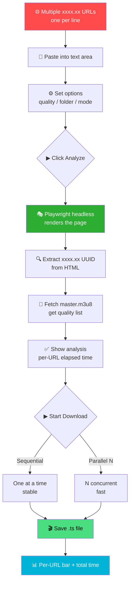
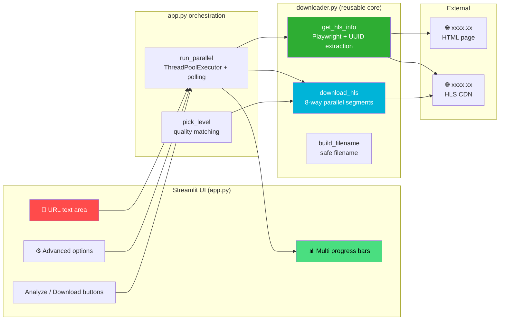
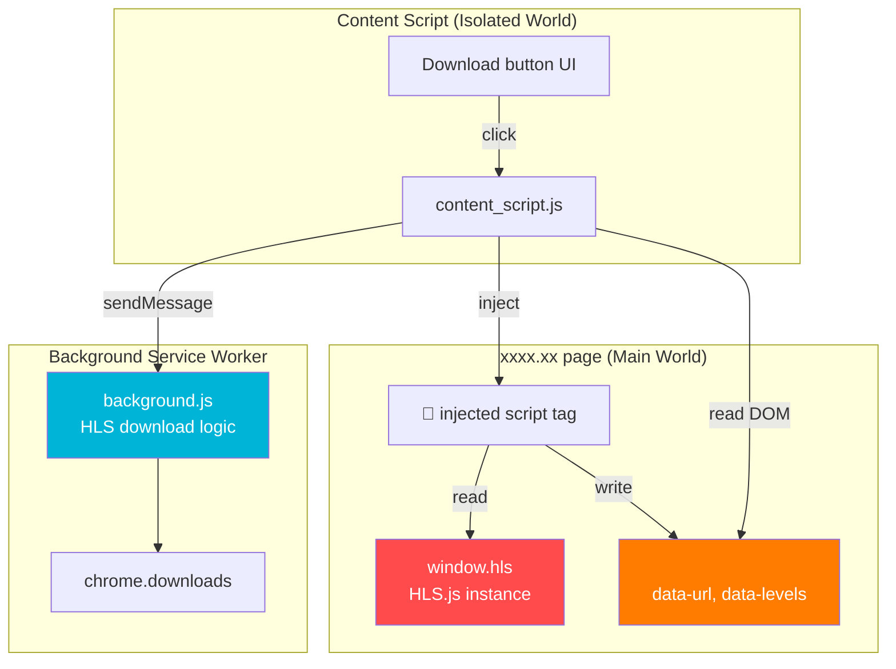
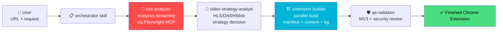

# 📼 crawl-video - HLS Video Downloader & Extension Generator Harness

<div align="center">

[](https://www.python.org)
[](https://streamlit.io)
[](https://playwright.dev)
[](https://developer.chrome.com/docs/extensions/mv3/intro/)
[](https://docs.anthropic.com/en/docs/claude-code)

> 🇰🇷 [한국어 README](./README.md)

**Batch-download HLS streams with Playwright + Streamlit. Two-phase analyze/download with parallel processing** ✨

[🎯 Features](#-features) | [💻 Run Locally](#-running-locally) | [🎮 Usage](#-usage) | [🛠️ Harness](#-harness-claude-code)

</div>

---

## 🎯 Project Overview

**crawl-video** is a single repository that bundles three complementary artifacts:

1. **🐍 `missav-dl/` — Python Streamlit HLS Downloader (main tool)**
   Paste multiple xxxx.xx URLs and the app analyzes them in one batch, then downloads sequentially or in parallel. It uses headless Playwright to render the page, extracts the xxxx.xx UUID, and fetches the m3u8 master playlist.

2. **🐳 `extensions/missav/` — Chrome Extension (alternative, reference)**
   Manifest V3 extension. Because Chrome content scripts run in an `isolated world`, it injects a `<script>` tag bridge to read `window.hls` from the main world. Useful when you want an in-page button, but the Python tool is recommended.

3. **🤖 `.claude/` — Claude Code Harness**
   A multi-stage agent pipeline that uses Playwright MCP to analyze any video site and auto-generate a Chrome Extension. Avoids re-implementing from scratch when adapting to a new site.

### ✨ Features

#### `missav-dl/` (Python Streamlit) — **Recommended**

- 📋 **Multi-URL batch processing** — paste one URL per line in the text area
- 🔍 **Two-phase analyze / download** — analyze all URLs first, review results, then download
- ⚙️ **Advanced options** — `Sequential` / `Parallel` mode, concurrency slider (1–5, default 2)
- 🎚️ **Global preferred quality** — pick once, applied to all URLs (auto-falls back to nearest lower quality)
- ⏱️ **Per-URL + total elapsed time**
- 🛡️ **Error isolation** — failures on some URLs don't stop the rest
- 📂 **Saves directly to local folder** — no memory limits, handles large files

#### `extensions/missav/` (Chrome MV3)

- 🎥 **In-page download button** — auto-injected below `.aspect-w-16` player
- 🪟 **Popup UI** — quick access from the extension icon
- 🌉 **Isolated-world bridge** — main-world `window.hls` → DOM `<meta>` tag → content script

#### `.claude/` (Harness)

- 🤖 **4 agents**: site-analyzer, video-strategy-analyst, extension-builder, qa-validator
- 📚 **4 skills**: orchestrator, playwright-site-analyzer, video-download-strategy, chrome-extension-builder
- 🔄 **Automated pipeline**: site analysis → strategy → extension generation → QA

---

## 🎮 Usage



### 📝 Step-by-Step Guide (Streamlit UI)

| Step | Description |
|------|-------------|
| 1️⃣ Start server | Run `streamlit run app.py` and open `http://localhost:8501` |
| 2️⃣ Enter URLs | Paste xxxx.xx URLs into the text area, one per line (e.g., `https://xxxx.xx/ko/h_1724a141g00017`) |
| 3️⃣ Configure | Choose save folder + preferred quality (default 720p). Optionally expand ⚙ Advanced to switch sequential/parallel mode |
| 4️⃣ Analyze | Click `Analyze (N)` → review per-URL results and elapsed times |
| 5️⃣ Download | Click `Start Download (M)` → per-URL progress bars, then file size / time / segment count on completion |

### 🐳 (Alternative) Chrome Extension Usage

```bash
# 1. Open chrome://extensions/ → enable Developer Mode
# 2. "Load unpacked" → choose crawl-video/extensions/missav/ext/
# 3. Visit https://xxxx.xx/ko/<video> → button appears below the player
```

---

## 🏗️ Tech Stack

<div align="center">

| Category | Tech | Purpose |
|----------|------|---------|
| UI | Streamlit 1.35+ | Batch download web UI |
| Page rendering | Playwright (headless Chromium) | Bot-detection bypass + JS execution |
| HTTP client | httpx | m3u8 / segment fetch |
| Concurrency | ThreadPoolExecutor | Multi-URL + multi-segment parallel processing |
| Extension | Chrome Manifest V3 | In-page download (alternative) |
| Extension tests | Jest 29 | TDD unit tests |
| Harness | Claude Code Agents + Skills | Site-analysis automation |
| Python | 3.11+ | Runtime |

</div>

### 🎨 Architecture — `missav-dl/`



### 🌉 Chrome Extension — Isolated World Bridge



---

## 📁 Project Structure

```
crawl-video/
├── 📄 README.md
├── 📄 CLAUDE.md                       # harness trigger + change log
├── 📂 missav-dl/                      # 🐍 Python Streamlit downloader (main)
│   ├── 📄 pyproject.toml              # uv project (playwright, httpx, streamlit)
│   ├── 🔒 uv.lock                     # dependency lockfile
│   ├── 🔧 downloader.py               # get_hls_info / download_hls / build_filename
│   └── 🖥️ app.py                      # Streamlit UI + multi-URL orchestration
├── 📂 extensions/missav/              # 🐳 Chrome Extension (alternative)
│   ├── 📄 package.json                # Jest config
│   ├── 📂 ext/                        # ★ Chrome loads this directory
│   │   ├── 📄 manifest.json           # MV3 manifest
│   │   ├── 🎨 content_script.js       # In-page UI + main-world bridge
│   │   ├── ⚙️ background.js           # Service worker (download logic)
│   │   ├── 🪟 popup.html / popup.js   # Popup UI
│   │   └── 📂 lib/
│   │       ├── 🧮 m3u8-parser.js      # master/segment playlist parsing
│   │       └── 🛠️ download-utils.js   # filename/UUID utilities
│   └── 📂 __tests__/                  # Jest unit tests (27 tests)
└── 📂 .claude/                        # 🤖 Claude Code harness
    ├── 📂 agents/                     # 4 specialized agents
    │   ├── site-analyzer.md
    │   ├── video-strategy-analyst.md
    │   ├── extension-builder.md
    │   └── qa-validator.md
    └── 📂 skills/                     # 4 domain skills
        ├── video-downloader-extension-orchestrator/
        ├── playwright-site-analyzer/
        ├── video-download-strategy/
        └── chrome-extension-builder/
```

---

## 💻 Running Locally

### 📋 Prerequisites

- Python 3.11 or 3.12
- [uv](https://github.com/astral-sh/uv) package manager
- (optional) Chrome 111+ — only if you also want to use the extension

```bash
# Install uv (macOS / Linux)
curl -LsSf https://astral.sh/uv/install.sh | sh
```

### 🚀 Run — Python Downloader (recommended)

> 💡 **Note:** `streamlit` is not just a library — it ships a CLI of the same
> name. Run it inside the uv-managed virtualenv via `uv run streamlit ...` so
> it picks up the project dependencies. Calling `streamlit run app.py`
> directly would look up a global `streamlit`, which may not exist.

```bash
# 1. Clone
git clone https://github.com/izowooi/creative-plate.git
cd creative-plate/crawl-video/missav-dl

# 2. Install dependencies (creates .venv and syncs uv.lock)
uv sync

# 3. Download Playwright Chromium (first run only)
uv run playwright install chromium

# 4. Launch the Streamlit app
uv run streamlit run app.py
# → open http://localhost:8501 in your browser
```

Stop with `Ctrl+C` in the terminal. On subsequent runs only step 4 is needed.

### 🐳 Run — Chrome Extension (alternative)

```bash
# 1. Install Jest deps (only needed for tests)
cd creative-plate/crawl-video/extensions/missav
npm install

# 2. Run unit tests (27 tests)
npm test

# 3. Load into Chrome
# chrome://extensions/ → enable Developer Mode
# "Load unpacked" → select extensions/missav/ext/
```

### ⚙️ Streamlit UI Options

| Option | Default | Description |
|--------|---------|-------------|
| URL list | — | one URL per line |
| Save folder | `~/Downloads` | local path for `.ts` files |
| Preferred quality | `720p` | applied to all URLs; falls back to nearest lower if missing |
| Run mode | `Parallel` | `Sequential` / `Parallel` (advanced) |
| Concurrency | `2` | parallel worker count (1–5, advanced) |

---

## 🛠️ Harness (Claude Code)

The **video-downloader-extension-orchestrator** skill under `.claude/` is a meta-tool that uses Playwright MCP to analyze an arbitrary video site and auto-generate a Chrome Extension.



**Example invocation:**

```
User: "Analyze https://example-video-site.com and build a download extension"
→ orchestrator skill auto-triggers
→ Playwright MCP site analysis → strategy → extension generation → QA
```

**Components:**

| Agent | Role |
|-------|------|
| `site-analyzer` | Network monitoring, video URL pattern discovery, auth/DRM detection |
| `video-strategy-analyst` | HLS/DASH/direct/blob download strategy, MV3 permission spec |
| `extension-builder` | Splits into 3 sub-roles (manifest/content/background) for parallel build |
| `qa-validator` | Code completeness, security, least-privilege, MV3 compliance, ToS check |

---

## 🔬 Site Analysis Notes (xxxx.xx)

| Item | Value |
|------|-------|
| HLS URL location | `xxxx.xx/{UUID}/720p/video.m3u8` embedded directly in HTML |
| URL pattern | `https://xxxx.xx/{UUID}/{quality}/video.m3u8` |
| Qualities | 360p / 480p / 720p / 1080p |
| Segments | `video{N}.jpeg` (actually MPEG-TS, first byte `0x47`) |
| Auth | xxxx.xx requires `Referer: https://xxxx.xx/` header |
| DRM / Encryption | None |

> 💡 In headless mode `window.hls` doesn't initialize, but the server embeds the CDN URL directly in the HTML, so a regex extracts it reliably.

---

## 🎯 Roadmap

- [ ] **Retry logic** — auto-retry failed segment fetches (currently single-shot)
- [ ] **Adapters for other sites** — auto-generate via the harness
- [ ] **Pause / resume** — control mid-batch
- [ ] **CLI mode** — batch processing without Streamlit (`python -m missav_dl ...`)
- [ ] **Subtitle / metadata download** — save extras alongside video

---

## 🤝 Contributing

1. Fork and create a branch
2. Commit changes (`git commit -m 'feat: add new feature'`)
3. Push the branch (`git push origin feature/new-feature`)
4. Open a Pull Request

---

## 📄 License

MIT License — free to use, modify, and distribute.

> ⚠️ **Legal disclaimer**: This tool is for educational and personal technical-validation use. Verify the target site's terms of service and copyright laws before use. Use at your own risk.

---

## 👨‍💻 Author

**izowooi**

Bug reports and feature requests at [Issues](https://github.com/izowooi/creative-plate/issues).

---

<div align="center">

**⭐ If this project helped, please give it a Star! ⭐**

Made with ❤️ using Streamlit + Playwright + Claude Code

</div>
