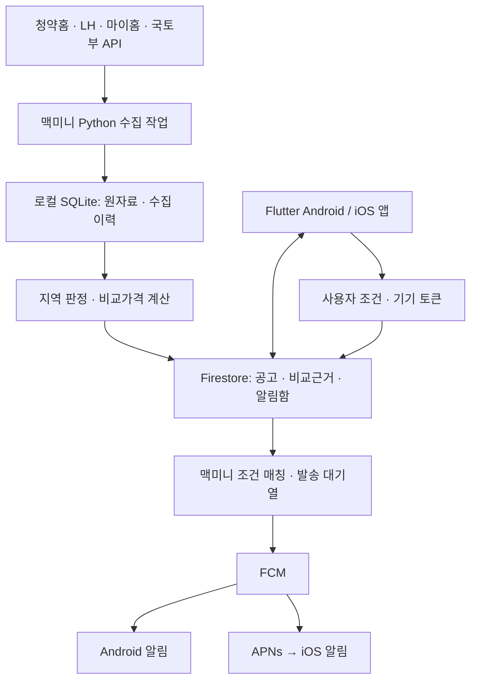

# 아파트 청약 알림 앱 사전 조사

조사일: **2026-09-23, 한국 시간**. 이번 작업은 조사와 개발 준비 문서 작성이다. 앱 구현, 계정 생성, 유료 서비스 신청, 배포는 수행하지 않았다.

## 1. 결론

**구현 가능하다.** 공식 청약 공고와 아파트 실거래 데이터를 수집하고, 사용자 거주지·관심 지역·분양가·주변 거래 대비 가격 차이로 필터링하여 Android/iOS에 알릴 수 있다. 맥미니에서 수집·계산·푸시 발송을 실행하는 방식도 가능하다.

다만 서비스의 약속은 다음처럼 정해야 한다.

| 원하는 기능 | 판단 | 구현할 때의 조건 |
| --- | --- | --- |
| 일반 아파트·무순위·잔여세대 알림 | 가능 | 청약홈의 유형별 API를 함께 수집 |
| LH 공고 알림 | 가능 | 공고 목록·상세·공급정보 API 연계 |
| SH 공고 알림 | 조건부 가능 | 마이홈 API의 SH 포함 범위·반영 지연 검증, 누락 시 공식 수집 경로 확보 |
| 거주지역에 맞는 공고 추천 | 가능 | 아파트 소재지와 신청 가능한 거주지역을 구분 |
| 청약 자격의 완전 자동 확정 | 초기 제품에서 약속하기 어려움 | 거주기간·무주택·세대·소득 등 공고별 조건과 사용자 정보 필요 |
| 주변 시세보다 5억 저렴한 공고 알림 | 추정치 기반으로 가능 | 비교 가능한 거래·면적·소유 형태를 확인하고 산정 근거 표시 |
| 모든 아파트의 정확한 오늘 시세 | 확인한 공공 API만으로 제공 불가 | 실거래 데이터에는 신고 시차와 거래 공백이 있음 |
| 한 번의 개발 지시로 스토어 출시까지 즉시 완료 | 보장 불가 | 계정 본인확인·서명·실기기 테스트·스토어 심사 등 외부 절차 존재 |

**현재 확인한 것은 공식 서비스 존재, 공개 명세, 제공 필드, 신청 조건이다. 사용자 API 키가 없어 인증 후 실제 공고·거래 조회, SH 누락률, 푸시 수신은 아직 검증하지 않았다.**

이어서 [준비 체크리스트와 답변 양식](02-preparation.md)을 작성하고, 준비가 끝나면 [개발용 goal 프롬프트](03-goal-prompt.md)를 사용하면 된다.

## 2. 확보할 데이터와 공식 신청 링크

아래 한도는 조사일 포털에 표시된 **개발계정 신청 가능 트래픽**이다. 운영 시 일일 적용량·초당 제한·승인기간은 발급 계정에서 다시 확인한다. 모두 조사일 기준 무료, 이용허락범위 제한 없음으로 표시되지만, 연결된 홈페이지·공고 첨부물·제3자 자료의 재배포 조건까지 일괄 보장하는 뜻은 아니다.

| 우선순위 | 서비스 / 신청 링크 | 쓰임 | 표시 한도 / 승인 |
| --- | --- | --- | --- |
| 필수 | [한국부동산원 청약홈 분양정보 조회](https://www.data.go.kr/data/15098547/openapi.do) | 일반 APT, 무순위·잔여세대, 임의공급과 주택형별 가격 | 40,000 / 개발 자동·운영 심의 |
| 필수 | [국토부 아파트 매매 실거래가 상세 자료](https://www.data.go.kr/data/15126468/openapi.do) | 주변 거래 비교 | 10,000 / 개발·운영 자동 |
| LH 필수 | [LH 분양임대공고문 조회](https://www.data.go.kr/data/15058530/openapi.do) | 신규·진행·정정 공고 탐지 | 10,000 / 개발·운영 자동 |
| LH 필수 | [LH 분양임대공고별 상세정보](https://www.data.go.kr/data/15057999/openapi.do) | 단지·접수·일정 등 보강 | 10,000 / 개발·운영 자동 |
| LH 필수 | [LH 분양임대공고별 공급정보](https://www.data.go.kr/data/15056765/openapi.do) | 주택형·공급 내역 보강 | 10,000 / 개발·운영 자동 |
| SH 검증 우선 | [마이홈포털 공공주택 모집공고 조회](https://www.data.go.kr/data/15108420/openapi.do) | 공공분양·공공임대 및 공급기관별 공고 확인 | 1,000 / 개발·운영 자동 |

개발계정 자동승인은 발급 직후 모든 요청의 성공이나 전체 공고의 누락 없는 제공을 뜻하지 않는다. 각각 활용신청하고 최근 공고·가격·페이지 처리부터 확인해야 한다.

### 청약홈: 가격과 줍줍을 함께 확보할 수 있다

[공식 포털이 연결하는 OpenAPI 명세](https://infuser.odcloud.kr/api/stages/37000/api-docs?1643022751478)를 직접 읽어 아래 기능을 확인했다. 기본 주소는 `https://api.odcloud.kr/api/ApplyhomeInfoDetailSvc/v1`이다.

| 구분 | 공고 상세 | 주택형별 상세 |
| --- | --- | --- |
| APT | `getAPTLttotPblancDetail` | `getAPTLttotPblancMdl` |
| 무순위·잔여세대 | `getRemndrLttotPblancDetail` | `getRemndrLttotPblancMdl` |
| 임의공급 | `getOPTLttotPblancDetail` | `getOPTLttotPblancMdl` |

명세의 `HOUSE_MANAGE_NO`와 `PBLANC_NO`로 연결한다. 잔여세대 명세는 `HOUSE_SECD`의 04를 무순위, 06을 불법행위 재공급으로 구분하므로 모두 같은 자격규칙으로 처리하면 안 된다. 과거에 통칭한 계약취소 후 재공급 등도 실제 공고 유형을 보존한다.

가격 필드는 `LTTOT_TOP_AMOUNT`: **주택형별 분양최고금액, 만원 단위**다. `SUPLY_AR`는 공급면적이다. 전용면적은 공고·유형별 원자료로 별도 확인하고, 이를 국토부의 전용면적과 혼동하지 않는다. `SUBSCRPT_AREA_CODE`도 **공급지역** 코드이므로 거주지 신청자격으로 대체할 수 없다. 이러한 의미는 위 공개 명세에서 확인했다.

개별 동·층 가격, 발코니 확장비, 필수 옵션, 거주기간과 예외 조건은 모집공고문으로 보강할 수 있다. 파싱되지 않는 항목은 미확인으로 남기고, 확인된 값만 가격 알림에 사용한다. 모든 공고에서 같은 필드가 채워진다는 보장은 아직 없다.

### LH: 목록만 받아서는 충분하지 않다

공고 목록을 받은 뒤 해당 공고의 식별자와 유형코드로 상세·공급정보를 조회한다. 공개 페이지에서 확인한 요청 주소는 다음과 같다. 자세한 파라미터는 각 신청 페이지의 최신 활용가이드를 따른다.

- 목록: `https://apis.data.go.kr/B552555/lhLeaseNoticeInfo1/lhLeaseNoticeInfo1`
- 상세: `https://apis.data.go.kr/B552555/lhLeaseNoticeDtlInfo1/getLeaseNoticeDtlInfo1`
- 공급: `https://apis.data.go.kr/B552555/lhLeaseNoticeSplInfo1/getLeaseNoticeSplInfo1`

공고 하나가 여러 단지·주택형을 포함할 수 있으므로 공고와 공급 항목을 분리한다. 분양·임대·토지·상가가 섞인 서비스라서 아파트 대상 필터도 필요하다. 가격 필드의 충실도와 첨부문서 확보는 실제 응답에서 확인해야 한다. [목록 명세](https://www.data.go.kr/data/15058530/openapi.do), [상세 명세](https://www.data.go.kr/data/15057999/openapi.do), [공급 명세](https://www.data.go.kr/data/15056765/openapi.do)

### SH: 마이홈부터 검증하고, 필요한 부분만 추가 수집한다

[SH 주택분양 정보](https://www.data.go.kr/data/15008820/fileData.do)는 조사일 기준 공급계획을 제공하는 1회성 파일 데이터다. API 형식으로 변환되어 있어도 일별 모집공고 피드를 대신하지 못한다.

반면 [마이홈 공개 명세](https://www.data.go.kr/data/15108420/openapi.do)에는 다음 두 operation이 실제 존재한다. 포털의 설명문은 임대 중심이지만 명세에는 분양도 있으므로, 설명문만 읽고 제외하지 않는다.

- `https://apis.data.go.kr/1613000/HWSPR02/rsdtRcritNtcList`: 공공임대 모집공고
- `https://apis.data.go.kr/1613000/HWSPR02/ltRsdtRcritNtcList`: 공공분양 모집공고

두 응답 모델에서 `suplyInsttNm`, `pblancId`, `houseSn`, `beforePblancId`, 원문 URL, 주소, 모집기간 등을 확인했다. 분양 모델의 최소 계약금·중도금·잔금은 동일 주택형의 총 분양가인지 확인하기 전에는 단순 합산하지 않는다.

**SH가 실제로 포함되는지, 어떤 유형이 누락되는지, 정정이 얼마나 늦게 반영되는지는 미검증이다.** 최근 SH 원문 공고와 API 응답을 날짜·유형별로 대조한다. 이 조사 환경에서 SH 사이트 직접 열람은 robots 제한으로 확인하지 못했다. 이는 크롤링에 대한 법적 허용·금지 판단을 의미하지 않는다.

누락이 있으면 SH에 공식 API·RSS·데이터 제공 또는 공개 게시판 자동수집·요약 이용 조건을 문의한다. 허용되는 공개 경로만 사용하고, 로그인·CAPTCHA를 우회하는 수집을 설계하지 않는다. 확보 전에는 SH를 ‘전체 지원’이라고 표시하지 않는다. LH와 SH 외의 지방공사·사업주체 자체 공고까지 포괄하려면 별도 수집 범위 검증이 필요하다.

### 시세: 국토부 거래로 비교값을 만든다

[실거래가 상세 API](https://www.data.go.kr/data/15126468/openapi.do)의 명세에서 다음을 확인했다.

- 요청: `https://apis.data.go.kr/1613000/RTMSDataSvcAptTradeDev/getRTMSDataSvcAptTradeDev`
- 범위: 법정동 코드 앞 5자리 `LAWD_CD` + 계약년월 `DEAL_YMD`, 페이지별 조회.
- 필드: 거래금액 `dealAmount`는 만원, `excluUseAr`는 전용면적. 단지 일련번호, 건축년도, 층, 거래유형, 해제여부·해제일 등 제공.
- 응답: XML. 금액은 앱 내부에서 원 단위 정수로 통일한다.

거래 신고는 계약 후 30일 이내이며, 국토부 안내는 신고관청 승인 후 익일 공개라고 설명한다. 매일 API를 받아도 당일 시세가 되는 것은 아니다. 해제·정정도 이전 계약월에 반영될 수 있다. [국토부 실거래가 신고·조회 Q&A](https://molit.go.kr/USR/policyTarget/dtl.jsp?idx=614)

호갱노노의 일반 개발자용 공개 시세 API와 상업적 재사용 허용은 이번 조사에서 확인하지 못했다. 초기 제품은 호갱노노 크롤링에 의존하지 않고 국토부 거래로 시작하는 편이 현실적이다. 별도 감정·호가·민간 시세가 필요하면 데이터 사업자와 제공 범위·저장·재배포·가격을 협의한다.

## 3. 지역 필터는 두 가지로 나눈다

사용자는 **현재 주민등록상 거주지**와 **알림을 받고 싶은 아파트 지역**을 따로 선택한다. GPS 권한은 필요 없다. 서울 거주자가 경기 아파트에 관심이 있는 경우도 지원해야 한다.

공고에는 공급위치, 신청 가능한 거주지역, 해당지역 우선공급, 최소 거주기간, 기준일, 전국 신청 여부를 별도로 저장한다. 해당지역 우선공급은 타지역 신청 불가와 다르다. ‘전국 신청’도 무주택 등 다른 조건의 면제를 뜻하지 않는다. LH 역시 정확한 자격·선정 기준은 분양시점 모집공고를 확인하도록 안내한다. [LH 분양가이드](https://apply.lh.or.kr/lhapply/cm/cntnts/cntntsView.do?cntntsId=1201476&mi=1202028)

권장 초기 판정은 `지역 조건 일치 / 불일치 / 확인 필요`다. 근거 문구·원문 위치·공고 버전을 함께 저장한다. 원문이 없거나 해석이 애매하면 ‘전국’으로 간주하지 않는다. 확인 필요 공고를 받을지는 사용자가 선택하며, 기본 추천은 별도 표시하여 받는 것이다. 이것을 ‘청약 자격 확정’으로 표현하지 않는다.

무주택·세대주·연령·청약통장·소득·자산·재당첨 제한 등은 별도의 조건이다. 초기에는 상세 안내와 공식 신청 링크를 제공한다. 정교한 자격 판정은 추가 사용자 정보와 규칙 검증이 확보된 뒤 확장한다. 규칙은 고정된 과거 상식 대신 해당 공고일의 공식 공고를 기준으로 관리한다.

## 4. ‘주변보다 5억 저렴함’의 계산

아파트도 단지, 전용면적, 준공연도, 층, 향, 입지, 소유 형태가 다르면 가격이 달라진다. 아래는 **초기 개발을 위한 제안 규칙**이며, 검증된 감정평가 모델은 아니다.

1. 공급 항목별 전용면적과 가격 기준을 확인한다. 한 단지의 가장 싼 소형과 주변 대형을 비교하지 않는다.
2. 동일 단지·유사 전용면적 거래를 우선한다. 신축 등 동일 단지 거래가 없으면 인근 비교 단지를 사용했다고 표시한다.
3. 인근 비교는 기본 반경 1km, 전용면적 ±5%, 최근 180일을 후보 기준으로 제안한다. 준공연도·입지 차이로 비교가 부적절하면 제외한다. 거리만 가까운 고급 단지를 그대로 섞지 않는다.
4. 해제 거래는 제외한다. 직거래는 기본 비교에서 분리하고, 정상 거래의 큰 차이를 임의로 지우지 않는다. 면적 보정 여부와 제외 근거를 기록한다.
5. 유효 거래 5건 이상을 초기 가격 알림 기준으로 제안한다. 비교 단지·거래 수·최근 거래일·가격 분포·출처를 함께 보여준다. 5건 충족이 정확성 보장은 아니다.
6. 거래 부족·주소 매칭 실패·전용면적 미확인·소유 형태 불일치일 때는 ‘비교 불가’로 표시한다. 반경이나 기간을 자동으로 넓혀 정상 품질로 포장하지 않는다.

```text
비교 참고가격 = 검증된 비교 거래의 중앙값
비교 참고차액 = 비교 참고가격 - 해당 주택형의 공고 가격
비교 차이율 = 비교 참고차액 / 비교 참고가격 × 100
```

청약홈의 최고금액을 썼다면 ‘해당 주택형 분양최고가 기준’이라고 표시한다. 예컨대 비교 참고가격 11억, 분양최고가 6억이면 **비용 반영 전 참고차액 5억**이다. 확장·옵션 등 추가비가 3천만원이면 해당 비용 반영 차액은 4.7억이고, 세금·금융비용·미래 매도가격에 따라 결과가 다시 달라진다. 이를 확정 차익이나 예상 순이익으로 부르지 않는다.

필터는 최대 분양가, 최소 참고차액, 최소 차이율을 분리하고 동시에 지정하면 AND로 적용한다. 금액 미확인을 0원으로 처리하지 않는다. 가격 조건을 켠 사용자에게 가격 미확인 공고를 ‘조건 충족’으로 보내지 않는다. 일반 지역 알림에서는 확인 필요로 안내할 수 있다.

**임대보증금과 매매가격은 비교하지 않는다.** 토지임대부·지분형·이익공유형 등은 일반 소유권 분양과 구분하고 초기 가격 차액 필터에서 제외한다. SH의 토지임대부 주택처럼 건물만 분양하고 토지임대료가 생기는 사례가 있기 때문이다. [서울시 토지임대부 주택 설명](https://news.seoul.go.kr/citybuild/archives/518717)

지도 화면은 필수가 아니지만 거리 비교에는 주소·좌표 매칭이 필요하다. [카카오 Local 주소 검색](https://developers.kakao.com/docs/ko/local/dev-guide) 등 공식 지오코딩 서비스를 선택하고, 저장·재사용·표시 조건을 확인한다. 아직 주소가 없는 개발지구는 확인된 위치를 운영자가 보강하거나 비교를 보류한다.

## 5. 맥미니와 앱의 권장 구성

다음은 작은 베타를 위한 제안이다. Flutter는 한 프로젝트에서 Android와 iOS를 관리하며, Firebase의 Flutter용 푸시 연동 경로가 공식 제공된다. [Firebase Flutter FCM 가이드](https://firebase.google.com/docs/cloud-messaging/flutter/get-started)



앱 설정 저장과 공고 조회에는 항상 접근 가능한 저장소가 필요하다. Firestore를 사용하면 앱이 맥미니의 집 IP에 직접 접속하지 않아도 되고, 수집기는 외부로 요청하는 방식으로 동작한다. 이 구성에서는 맥미니 포트 개방이나 고정 IP가 필수가 아니다. 맥미니가 꺼지면 새 공고 반영·새 푸시는 멈추지만 마지막 저장 공고는 조회할 수 있게 설계한다.

익명 인증으로 로그인 화면 없이 시작하되, 다른 사용자의 설정·토큰을 읽지 못하도록 Security Rules를 적용한다. 관리자 키를 가진 서버 SDK는 별도 IAM 권한이 필요하다. 원거래 전체는 로컬에 두고 앱에는 필요한 비교 근거만 제공하여 비용과 데이터량을 줄인다. [Firestore Security Rules](https://firebase.google.com/docs/firestore/security/get-started)

| 작업 | 제안 주기 | 이유 |
| --- | --- | --- |
| 신규·진행·정정 공고 확인 | 07–22시 30분마다 + 야간 1회, KST | 하루 한 번이면 당일 변경·짧은 접수를 놓칠 수 있음 |
| 실거래 갱신 | 하루 1회 | 실시간 시세 피드가 아님 |
| 과거 거래 재조회 | 최근 3개월 매일, 그 이전 분석기간은 주 단위 분할 | 늦은 신고·해제·정정 반영; 오래된 수정의 잔여 지연은 표시 |
| 주소 매칭·가격 재계산 | 신규·변경 데이터 발생 시 | 동일 API를 사용자 수만큼 호출하지 않음 |
| 알림 발송·실패 재시도 | 공고 동기화 직후 및 짧은 별도 주기 | 수집과 발송 실패를 독립 복구 |

API의 실제 원천 갱신주기는 인증 실험에서 측정한다. 30분마다 조회한다고 원문 게시 후 30분 이내 탐지가 보장되지는 않는다. 호출 예산은 `지역 수 × 조회 개월 수 × 페이지 수`, 공고별 상세 조회와 재시도를 포함해 계산한다.

맥미니는 `launchd`로 실행하도록 구성할 수 있다. 절전·재부팅·네트워크 장애 후 마지막 성공시점부터 재수집하는 기능과 동시 실행 방지, 외부 heartbeat 감시, 백업·복구가 필요하다. 시스템 설정 변경은 실제 운영 준비 시 별도로 적용한다. [Apple 예약 작업 문서](https://developer.apple.com/library/archive/documentation/MacOSX/Conceptual/BPSystemStartup/Chapters/ScheduledJobs.html)

FCM 발송 성공은 단말 수신을 뜻하지 않는다. 수신 허용 여부·네트워크·OS 상태에 따라 지연될 수 있으므로 앱 알림함을 함께 보관하고, 마감된 알림에는 TTL을 적용한다. 서버 중복 발송을 억제하되 네트워크 재시도까지 포함한 ‘푸시 정확히 한 번 전달’을 보장하지 않는다. [FCM 전달 수명 안내](https://firebase.google.com/docs/cloud-messaging/customize-messages/setting-message-lifespan)

## 6. 구현 전에 통과시킬 데이터 검증

API 승인이 나면 앱 화면보다 먼저 작은 데이터 검증을 한다. 아래 수치는 제안하는 합격 기준이다.

| 검증 | 합격 기준 |
| --- | --- |
| 실제 API 연결 | 핵심 6개 신청 서비스의 승인·정상 응답·페이지 끝까지 수집 확인 |
| 공고 정확성 | 최근 대표 공고 약 20건에서 공고번호·유형·지역·접수일·원문 링크 대조 |
| SH 범위 | 선택 기간의 SH 원문 모집·정정 공고 전수를 유형별로 대조하고 누락·지연 기록; 공고가 없으면 기간 확장 |
| 지역 필터 | 전국, 특정 시도, 해당지역 우선, 거주기간, 불명확 공고에서 기대 결과 검증 |
| 가격 | 주택형별 단위·면적·최고가 의미를 원문과 대조; 불명확 데이터는 알림 차단 |
| 실거래 | 페이지 처리·해제·정정·중복을 확인하고 계산 근거를 재현 |
| 푸시 | Android/iPhone에서 허용·거절, foreground/background, 앱 실행 전 상태와 클릭 이동 확인 |
| 운영 복구 | 작업 재실행·동시 실행·실패 후 재개에서 대기열 중복과 누락 점검 |

소스 장애는 ‘신규 공고 0건’과 다르게 표시한다. 날짜순 신규 조회만으로는 기존 공고 정정을 잡기 어려워 최근 구간 재조회와 진행 중 공고 추적을 병행한다. 여러 소스에 있는 동일 공고는 출처를 보존하여 연결하고, 같은 단지의 다른 차수·정정 공고를 무조건 합치지 않는다.

## 7. 비용과 출시 준비의 범위

- 위 공공 API와 FCM은 조사일 기준 무료다. Firestore 등 저장소·읽기·쓰기·백업, 선택한 클라우드 작업은 별도 과금 가능하므로 ‘앱 운영비 전체가 0원’이라고 가정하지 않는다. [Firebase 요금](https://firebase.google.com/pricing)
- Apple Developer Program은 공식 안내상 연 **US$99 또는 현지 통화 가격**이다. iOS 푸시 연동에는 APNs 키와 앱 서명 설정을 준비한다. [Apple 멤버십](https://developer.apple.com/support/compare-memberships/)
- Google Play 개발자 등록은 공식 안내상 **US$25 일회성**이다. 로컬 Android 개발에 Play 등록부터 필요한 것은 아니다. [Play Console 시작](https://support.google.com/googleplay/android-developer/answer/6112435?hl=ko)
- 2023-11-13 이후 생성한 개인 Play 계정은 현재 안내상 **12명 이상이 연속 14일 참여한 비공개 테스트 후 프로덕션 접근 신청**이 필요하다. 기간 경과만으로 출시 승인이 보장되지는 않는다. [Google 테스트 요건](https://support.google.com/googleplay/android-developer/answer/14151465?hl=ko)
- 스토어 공개 전 개인정보처리방침 URL, 운영자·문의처, 수집 항목·보관·삭제·사용 SDK에 맞는 공개 설명을 준비한다. 로그인 화면이 없더라도 기기 토큰과 관심조건은 서비스가 처리한다. 계정을 제공하면 계정·연결 데이터 삭제 흐름도 준비한다. [Apple 개인정보 정책](https://developer.apple.com/app-store/review/guidelines/#privacy), [Google 사용자 데이터 정책](https://support.google.com/googleplay/android-developer/answer/10144311)

우선 권장하는 목표는 **선택한 지역과 검증된 소스를 대상으로 실제 푸시까지 동작하는 베타**다. SH를 필수 지원으로 정한다면 SH 데이터 검증을 완료 조건에 포함한다. 범위를 줄이려면 준비서에서 사용자가 명시적으로 선택하고, 전체 SH 지원을 완료한 것처럼 보고하지 않는다.
