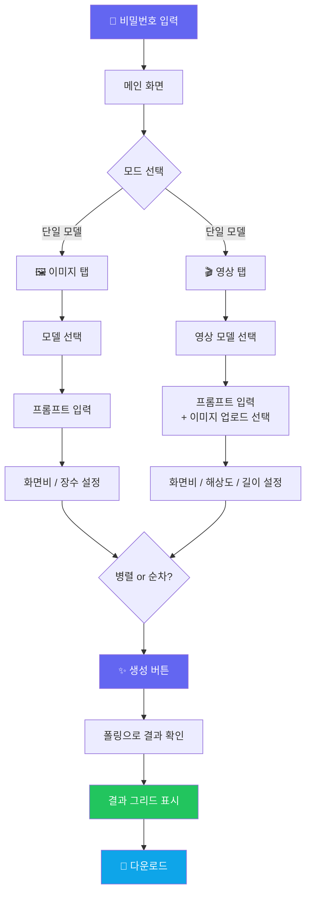
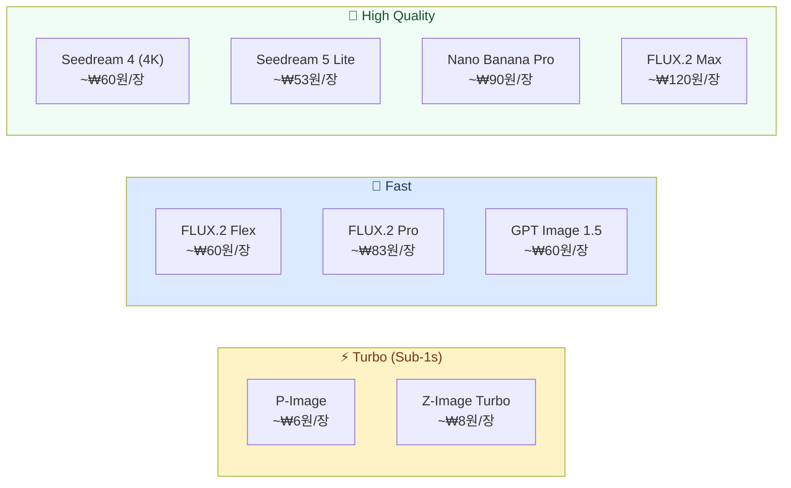

# 🎨 Pixel Palette - AI 이미지 & 영상 생성 플랫폼

<div align="center">

[](https://pixel-palette.pages.dev)
[](https://nextjs.org)
[](https://react.dev)
[](https://www.typescriptlang.org)
[](https://tailwindcss.com)
[](https://pages.cloudflare.com)

> 🇺🇸 [English README](./README_EN.md) | 🇨🇳 [中文 README](./README_ZH.md)

**여러 최신 AI 모델로 이미지와 영상을 생성하고 나란히 비교할 수 있는 플랫폼** ✨

[🎯 주요 기능](#-주요-기능) | [💻 로컬 실행](#-로컬에서-실행하기) | [🚀 배포하기](#-배포하기)

</div>

---

## 🎯 프로젝트 소개

**Pixel Palette**는 [Replicate API](https://replicate.com)를 활용해 최신 AI 이미지·영상 생성 모델을 한 곳에서 사용할 수 있는 웹 앱입니다. 단일 모델로 여러 장을 한 번에 뽑거나, 여러 모델에 같은 프롬프트를 보내 결과를 나란히 비교할 수 있습니다.

생성된 이미지와 영상은 서버에 저장되지 않으며, 모든 처리는 Edge Runtime 위에서 실행됩니다.

### ✨ 주요 기능

- 🖼️ **이미지 생성** — 9개 최신 모델 지원 (FLUX.2, Seedream, GPT Image, P-Image 등)
- 🎬 **영상 생성** — Seedance, Veo 3 등 최신 비디오 모델 지원
- ⚖️ **모델 비교 모드** — 같은 프롬프트로 여러 모델 결과를 나란히 비교
- 🖼️➡️🎬 **이미지-투-비디오 (I2V)** — 이미지를 업로드해 영상으로 변환
- ⚡ **병렬/순차 요청** — Rate limit 상황에 맞춰 자유롭게 선택
- 💰 **실시간 비용 추산** — USD / 원화(KRW) 전환 지원
- 🎛️ **고급 설정** — 모델별 seed, guidance, resolution 등 세밀한 조정
- 🌗 **다크/라이트 테마** — 시스템 설정 연동
- 🔒 **비밀번호 게이트** — 간단한 접근 제어
- 📦 **다운로드** — 개별 이미지 다운로드 (ZIP 일괄 다운로드 예정)
- 🚫 **서버 저장 없음** — 생성 결과는 세션에서만 유지

---

## 🎮 사용 방법



### 📝 단계별 가이드

| 단계 | 설명 |
|------|------|
| 1️⃣ 로그인 | 설정한 비밀번호를 입력해 접근 |
| 2️⃣ 탭 선택 | 상단의 **Images** 또는 **Video** 탭 선택 |
| 3️⃣ 모드 선택 | **단일 모델** (여러 장 생성) 또는 **모델 비교** (여러 모델 동시 실행) |
| 4️⃣ 모델 선택 | 원하는 AI 모델을 선택 (비용과 속도 배지 참고) |
| 5️⃣ 프롬프트 입력 | 영어로 입력할수록 더 좋은 결과 (최대 2,000자) |
| 6️⃣ 설정 조정 | 화면비, 장수, 고급 파라미터 조정 |
| 7️⃣ 생성 | 생성 버튼 클릭 → 폴링으로 실시간 진행 상황 확인 |
| 8️⃣ 다운로드 | 완성된 이미지/영상 개별 다운로드 |

---

## 🏗️ 기술 스택

<div align="center">

| 카테고리 | 기술 | 용도 |
|----------|------|------|
| **프레임워크** | Next.js 15 (App Router) | SSR + Edge Runtime |
| **UI 라이브러리** | React 19 | 클라이언트 컴포넌트 |
| **언어** | TypeScript 5 | 타입 안전성 |
| **스타일링** | Tailwind CSS 3 | 유틸리티 퍼스트 CSS |
| **배포** | Cloudflare Pages | Edge 배포 |
| **런타임** | Cloudflare Edge Runtime | 저지연 API 라우트 |
| **AI API** | Replicate API | 이미지·영상 모델 호스팅 |
| **빌드 도구** | @cloudflare/next-on-pages + Wrangler | CF Pages 호환 빌드 |

</div>

### 🎨 아키텍처

```mermaid
graph LR
    subgraph Browser["🌐 Browser (Client)"]
        UI[Next.js App\nReact 19 + Tailwind]
        UI -->|fetch POST| API
        UI -->|polling GET| STATUS
    end

    subgraph CF["☁️ Cloudflare Pages (Edge)"]
        API["/api/generate\nEdge Runtime"]
        APIV["/api/generate-video\nEdge Runtime"]
        STATUS["/api/status/[id]\nEdge Runtime"]
        DL["/api/download\nEdge Runtime"]
        UPLOAD["/api/upload-image\nEdge Runtime"]
    end

    subgraph Replicate["🤖 Replicate API"]
        IMG_MODELS["이미지 모델\nFLUX · Seedream · GPT Image\nP-Image · Nano Banana"]
        VID_MODELS["영상 모델\nSeedance · Veo 3 · CogVideoX\nWan · HunyuanVideo"]
    end

    API -->|POST /predictions| IMG_MODELS
    APIV -->|POST /predictions| VID_MODELS
    STATUS -->|GET /predictions/[id]| Replicate

    style Browser fill:#e0e7ff,color:#1e1b4b
    style CF fill:#fff7ed,color:#7c2d12
    style Replicate fill:#f0fdf4,color:#14532d
```

---

## 📁 프로젝트 구조

```
pixel-palette/
├── 📁 app/                      # Next.js App Router
│   ├── 📄 layout.tsx            # 루트 레이아웃 (폰트, 테마)
│   ├── 📄 page.tsx              # 이미지 생성 메인 페이지
│   ├── 📁 video/
│   │   └── 📄 page.tsx          # 영상 생성 페이지
│   └── 📁 api/
│       ├── 📁 generate/         # 이미지 생성 API (Edge)
│       ├── 📁 generate-video/   # 영상 생성 API (Edge)
│       ├── 📁 status/[id]/      # 예측 상태 폴링 API (Edge)
│       ├── 📁 download/         # 이미지 프록시 다운로드 (Edge)
│       └── 📁 upload-image/     # I2V용 이미지 업로드 (Edge)
├── 📁 components/               # React 공유 컴포넌트
│   ├── 📄 ModelSelector.tsx     # 이미지 모델 선택 UI
│   ├── 📄 VideoModelSelector.tsx# 영상 모델 선택 UI
│   ├── 📄 AdvancedSettings.tsx  # 이미지 고급 파라미터
│   ├── 📄 VideoAdvancedSettings.tsx # 영상 고급 파라미터
│   ├── 📄 ImageGrid.tsx         # 생성된 이미지 그리드
│   ├── 📄 VideoGrid.tsx         # 생성된 영상 그리드
│   ├── 📄 LoadingMessages.tsx   # 생성 중 메시지 컴포넌트
│   ├── 📄 PasswordGate.tsx      # 비밀번호 인증 화면
│   └── 📄 ThemeToggle.tsx       # 다크/라이트 테마 토글
├── 📁 lib/
│   ├── 📄 models.ts             # 이미지 모델 설정 & 비용 계산
│   └── 📄 videoModels.ts        # 영상 모델 설정 & 비용 계산
├── 📁 docs/t2i/                 # 모델별 API 문서 (llms.txt 형식)
├── 📄 .env.example              # 환경 변수 예시
├── 📄 next.config.ts            # Next.js 설정
└── 📄 tailwind.config.ts        # Tailwind 설정
```

---

## 💻 로컬에서 실행하기

### 📋 사전 준비물

- Node.js 20 이상
- [Replicate](https://replicate.com) 계정 및 API 토큰

### 🔧 환경 변수 설정

`.env.example`을 복사해 `.env.local`을 생성하세요:

```bash
cp .env.example .env.local
```

```env
# Replicate API 토큰 (서버 전용 — 클라이언트에 노출하지 마세요)
REPLICATE_API_TOKEN=r8_xxxxxxxxxxxxxxxxxxxx

# 앱 접근 비밀번호 (간단한 게이트 용도)
NEXT_PUBLIC_APP_PASSWORD=your-password-here
```

### 🚀 실행 방법

```bash
# 1. 저장소 클론
git clone https://github.com/izowooi/creative-plate.git
cd creative-plate/pixel-palette

# 2. 의존성 설치
npm install

# 3. 개발 서버 실행 (Turbopack)
npm run dev
```

브라우저에서 [http://localhost:3000](http://localhost:3000) 열기

### ⚙️ 사용 가능한 명령어

| 명령어 | 설명 |
|--------|------|
| `npm run dev` | Turbopack 개발 서버 실행 |
| `npm run build` | 프로덕션 빌드 |
| `npm run start` | 프로덕션 서버 실행 |
| `npm run lint` | ESLint 실행 |
| `npm run pages:build` | Cloudflare Pages용 빌드 |
| `npm run preview` | Cloudflare Pages 로컬 미리보기 |
| `npm run deploy` | Cloudflare Pages 배포 |

---

## 🚀 배포하기

### Cloudflare Pages 배포

이 앱은 **Cloudflare Pages + Edge Runtime** 환경에 최적화되어 있습니다.

#### 1. Cloudflare 로그인

```bash
npx wrangler login
```

#### 2. 배포

```bash
npm run deploy
```

#### 3. 환경 변수 설정

Cloudflare 대시보드 → Pages → 프로젝트 → Settings → Environment variables에서 아래 값을 설정하세요:

| 변수명 | 설명 |
|--------|------|
| `REPLICATE_API_TOKEN` | Replicate API 토큰 |
| `NEXT_PUBLIC_APP_PASSWORD` | 앱 접근 비밀번호 |

또는 CLI로:

```bash
npx wrangler pages secret put REPLICATE_API_TOKEN
npx wrangler pages secret put NEXT_PUBLIC_APP_PASSWORD
```

---

## 🤖 지원 AI 모델

### 이미지 모델



### 영상 모델

| 모델 | 벤더 | 특징 | 가격 |
|------|------|------|------|
| Seedance Pro Fast 🇨🇳 | ByteDance | 빠른 추론, I2V 지원 | ~$0.04/초 |
| Veo 3 Fast 🇺🇸 | Google | 오디오 자동 생성 | ~$0.05/초 |
| CogVideoX 🇨🇳 | Zhipu AI | 오픈소스, 텍스트 정확 | ~$0.03/초 |
| Wan 2.1 🇨🇳 | Alibaba | I2V + Last Frame 보간 | ~$0.02/초 |
| HunyuanVideo 🇨🇳 | Tencent | 고품질, 긴 영상 | ~$0.05/초 |

---

## 🎯 향후 개선 사항

- [ ] ZIP 일괄 다운로드
- [ ] 프롬프트 히스토리 저장
- [ ] 이미지 편집 (인페인팅 / 아웃페인팅)
- [ ] FLUX.2 Pro 이미지-투-이미지 편집
- [ ] 사용량 대시보드

---

## 🤝 기여하기

1. 이 저장소를 Fork 합니다
2. 새 브랜치를 만듭니다: `git checkout -b feature/amazing-feature`
3. 변경 사항을 커밋합니다: `git commit -m 'Add amazing feature'`
4. 브랜치에 Push 합니다: `git push origin feature/amazing-feature`
5. Pull Request를 생성합니다

---

## 📄 라이선스

MIT License — 자유롭게 사용, 수정, 배포하실 수 있습니다.

---

## 👨‍💻 만든 사람

**izowooi**

버그 신고나 기능 제안은 [Issues](https://github.com/izowooi/creative-plate/issues)에 남겨주세요.

---

<div align="center">

**⭐ 이 프로젝트가 마음에 드셨다면 Star를 눌러주세요! ⭐**

Made with ❤️ using Next.js + Replicate API

[🎨 지금 사용하기](https://pixel-palette.pages.dev)

</div>
