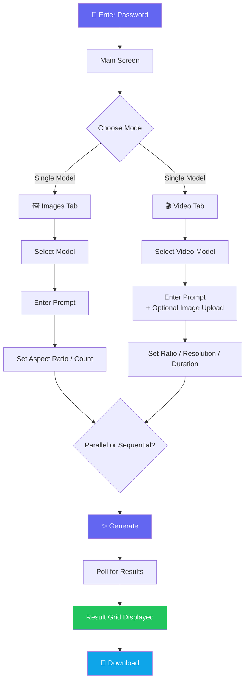
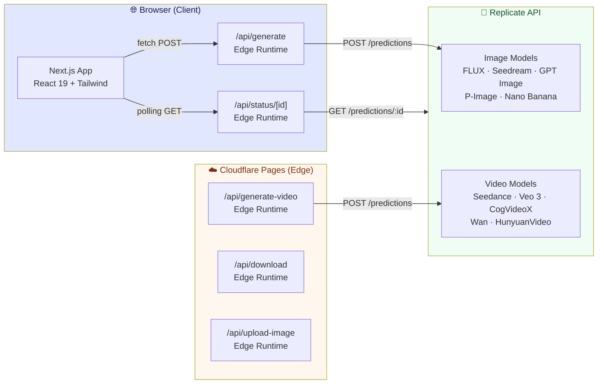
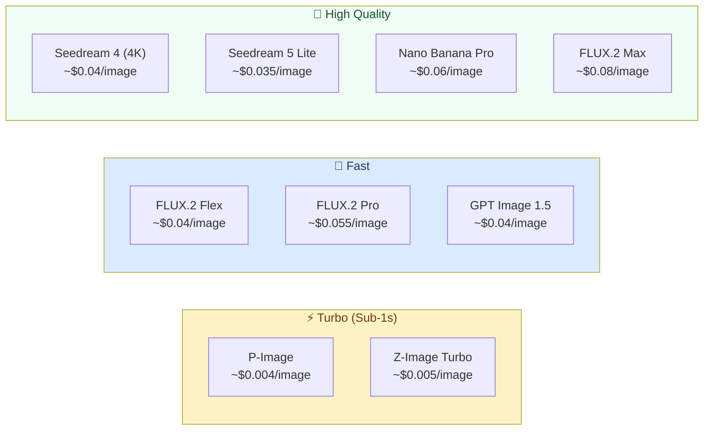

> 🇰🇷 [한국어 README](./README.md) | 🇨🇳 [中文 README](./README_ZH.md)

# 🎨 Pixel Palette - AI Image & Video Generation Platform

<div align="center">

[](https://pixel-palette.pages.dev)
[](https://nextjs.org)
[](https://react.dev)
[](https://www.typescriptlang.org)
[](https://tailwindcss.com)
[](https://pages.cloudflare.com)

**Generate images and videos with the latest AI models — and compare them side by side** ✨

[🎯 Features](#-features) | [💻 Local Setup](#-local-setup) | [🚀 Deploy](#-deploy)

</div>

---

## 🎯 About

**Pixel Palette** is a web app that lets you use cutting-edge AI image and video generation models through the [Replicate API](https://replicate.com) — all in one place. Generate multiple images with a single model, or send the same prompt to several models and compare the results side by side.

Generated images and videos are never stored on the server. All API routes run on Cloudflare's Edge Runtime for low latency worldwide.

### ✨ Features

- 🖼️ **Image Generation** — 9 state-of-the-art models (FLUX.2, Seedream, GPT Image, P-Image, etc.)
- 🎬 **Video Generation** — Seedance, Veo 3, and more video models
- ⚖️ **Model Compare Mode** — Same prompt, multiple models, results side by side
- 🖼️➡️🎬 **Image-to-Video (I2V)** — Upload an image and animate it
- ⚡ **Parallel / Sequential Requests** — Choose based on rate-limit constraints
- 💰 **Real-time Cost Estimate** — Switch between USD and KRW
- 🎛️ **Advanced Settings** — Per-model controls: seed, guidance, resolution, and more
- 🌗 **Dark / Light Theme** — Syncs with system preference
- 🔒 **Password Gate** — Simple access control
- 📦 **Download** — Save individual images (ZIP batch download coming soon)
- 🚫 **No Server Storage** — Results exist only in the current session

---

## 🎮 How to Use



### 📝 Step-by-Step Guide

| Step | Description |
|------|-------------|
| 1️⃣ Login | Enter the app password |
| 2️⃣ Pick a Tab | Select **Images** or **Video** at the top |
| 3️⃣ Choose Mode | **Single Model** (multiple outputs) or **Compare** (multiple models) |
| 4️⃣ Select Model | Pick an AI model — check the cost and speed badges |
| 5️⃣ Write a Prompt | English prompts generally produce better results (max 2,000 chars) |
| 6️⃣ Adjust Settings | Aspect ratio, count, and advanced parameters |
| 7️⃣ Generate | Click the button — watch real-time progress via polling |
| 8️⃣ Download | Save your images or videos individually |

---

## 🏗️ Tech Stack

<div align="center">

| Category | Technology | Purpose |
|----------|-----------|---------|
| **Framework** | Next.js 15 (App Router) | SSR + Edge Runtime |
| **UI Library** | React 19 | Client components |
| **Language** | TypeScript 5 | Type safety |
| **Styling** | Tailwind CSS 3 | Utility-first CSS |
| **Deployment** | Cloudflare Pages | Edge deployment |
| **Runtime** | Cloudflare Edge Runtime | Low-latency API routes |
| **AI API** | Replicate API | Image & video model hosting |
| **Build Tool** | @cloudflare/next-on-pages + Wrangler | CF Pages-compatible build |

</div>

### 🎨 Architecture



---

## 📁 Project Structure

```
pixel-palette/
├── 📁 app/                      # Next.js App Router
│   ├── 📄 layout.tsx            # Root layout (fonts, theme)
│   ├── 📄 page.tsx              # Image generation main page
│   ├── 📁 video/
│   │   └── 📄 page.tsx          # Video generation page
│   └── 📁 api/
│       ├── 📁 generate/         # Image generation API (Edge)
│       ├── 📁 generate-video/   # Video generation API (Edge)
│       ├── 📁 status/[id]/      # Prediction status polling (Edge)
│       ├── 📁 download/         # Image proxy download (Edge)
│       └── 📁 upload-image/     # I2V image upload (Edge)
├── 📁 components/               # Shared React components
│   ├── 📄 ModelSelector.tsx     # Image model selector UI
│   ├── 📄 VideoModelSelector.tsx# Video model selector UI
│   ├── 📄 AdvancedSettings.tsx  # Image advanced params
│   ├── 📄 VideoAdvancedSettings.tsx # Video advanced params
│   ├── 📄 ImageGrid.tsx         # Generated image grid
│   ├── 📄 VideoGrid.tsx         # Generated video grid
│   ├── 📄 LoadingMessages.tsx   # Generation progress messages
│   ├── 📄 PasswordGate.tsx      # Password auth screen
│   └── 📄 ThemeToggle.tsx       # Dark/light theme toggle
├── 📁 lib/
│   ├── 📄 models.ts             # Image model configs & cost calculation
│   └── 📄 videoModels.ts        # Video model configs & cost calculation
├── 📁 docs/t2i/                 # Per-model API docs (llms.txt format)
├── 📄 .env.example              # Environment variable template
├── 📄 next.config.ts            # Next.js config
└── 📄 tailwind.config.ts        # Tailwind config
```

---

## 💻 Local Setup

### 📋 Prerequisites

- Node.js 20 or later
- A [Replicate](https://replicate.com) account and API token

### 🔧 Environment Variables

Copy `.env.example` to create `.env.local`:

```bash
cp .env.example .env.local
```

```env
# Replicate API token (server-side only — never expose to the client)
REPLICATE_API_TOKEN=r8_xxxxxxxxxxxxxxxxxxxx

# App access password (simple gate)
NEXT_PUBLIC_APP_PASSWORD=your-password-here
```

### 🚀 Running Locally

```bash
# 1. Clone the repository
git clone https://github.com/izowooi/creative-plate.git
cd creative-plate/pixel-palette

# 2. Install dependencies
npm install

# 3. Start the development server (Turbopack)
npm run dev
```

Open [http://localhost:3000](http://localhost:3000) in your browser.

### ⚙️ Available Scripts

| Command | Description |
|---------|-------------|
| `npm run dev` | Start Turbopack dev server |
| `npm run build` | Production build |
| `npm run start` | Start production server |
| `npm run lint` | Run ESLint |
| `npm run pages:build` | Build for Cloudflare Pages |
| `npm run preview` | Local Cloudflare Pages preview |
| `npm run deploy` | Deploy to Cloudflare Pages |

---

## 🚀 Deploy

### Cloudflare Pages

This app is optimized for **Cloudflare Pages + Edge Runtime**.

#### 1. Log in to Cloudflare

```bash
npx wrangler login
```

#### 2. Deploy

```bash
npm run deploy
```

#### 3. Set Environment Variables

Go to the Cloudflare Dashboard → Pages → Your Project → Settings → Environment variables:

| Variable | Description |
|----------|-------------|
| `REPLICATE_API_TOKEN` | Replicate API token |
| `NEXT_PUBLIC_APP_PASSWORD` | App access password |

Or via CLI:

```bash
npx wrangler pages secret put REPLICATE_API_TOKEN
npx wrangler pages secret put NEXT_PUBLIC_APP_PASSWORD
```

---

## 🤖 Supported AI Models

### Image Models



### Video Models

| Model | Vendor | Highlights | Price |
|-------|--------|-----------|-------|
| Seedance Pro Fast 🇨🇳 | ByteDance | Fast inference, I2V support | ~$0.04/sec |
| Veo 3 Fast 🇺🇸 | Google | Auto audio generation | ~$0.05/sec |
| CogVideoX 🇨🇳 | Zhipu AI | Open-source, precise text | ~$0.03/sec |
| Wan 2.1 🇨🇳 | Alibaba | I2V + last-frame interpolation | ~$0.02/sec |
| HunyuanVideo 🇨🇳 | Tencent | High quality, longer clips | ~$0.05/sec |

---

## 🎯 Roadmap

- [ ] ZIP batch download
- [ ] Prompt history
- [ ] Image editing (inpainting / outpainting)
- [ ] FLUX.2 Pro image-to-image editing
- [ ] Usage dashboard

---

## 🤝 Contributing

1. Fork the repository
2. Create a feature branch: `git checkout -b feature/amazing-feature`
3. Commit your changes: `git commit -m 'Add amazing feature'`
4. Push to the branch: `git push origin feature/amazing-feature`
5. Open a Pull Request

---

## 📄 License

MIT License — free to use, modify, and distribute.

---

## 👨‍💻 Author

**izowooi**

File bug reports or feature requests on [Issues](https://github.com/izowooi/creative-plate/issues).

---

<div align="center">

**⭐ If you find this project useful, please give it a Star! ⭐**

Made with ❤️ using Next.js + Replicate API

[🎨 Try it now](https://pixel-palette.pages.dev)

</div>
