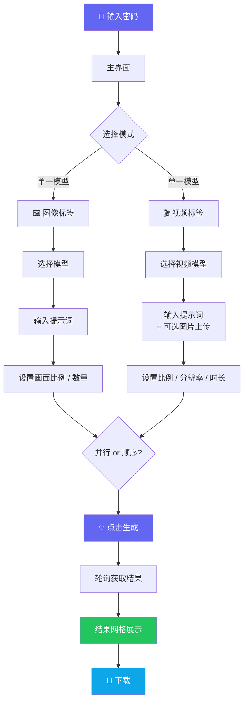
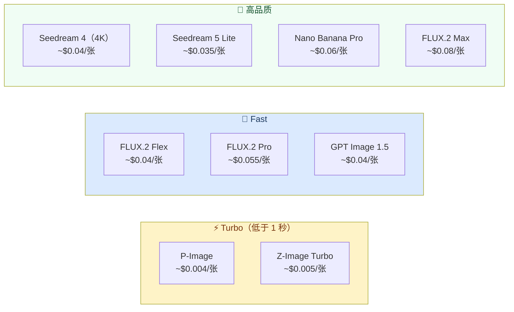

> 🇰🇷 [한국어 README](./README.md) | 🇺🇸 [English README](./README_EN.md)

# 🎨 Pixel Palette - AI 图像与视频生成平台

<div align="center">

[](https://pixel-palette.pages.dev)
[](https://nextjs.org)
[](https://react.dev)
[](https://www.typescriptlang.org)
[](https://tailwindcss.com)
[](https://pages.cloudflare.com)

**使用多种最新 AI 模型生成图像和视频，并排对比效果** ✨

[🎯 主要功能](#-主要功能) | [💻 本地运行](#-本地运行) | [🚀 部署](#-部署)

</div>

---

## 🎯 项目介绍

**Pixel Palette** 是一款通过 [Replicate API](https://replicate.com) 将最新 AI 图像与视频生成模型集于一处的 Web 应用。你可以用单个模型一次生成多张图像，也可以将同一提示词发送给多个模型，并排比较生成结果。

生成的图像和视频不会保存到服务器，所有 API 路由均运行在 Cloudflare Edge Runtime 上，具备极低的全球访问延迟。

### ✨ 主要功能

- 🖼️ **图像生成** — 支持 9 个最新模型（FLUX.2、Seedream、GPT Image、P-Image 等）
- 🎬 **视频生成** — 支持 Seedance、Veo 3 等最新视频模型
- ⚖️ **模型对比模式** — 同一提示词，多个模型结果并排展示
- 🖼️➡️🎬 **图生视频（I2V）** — 上传图片，将其转化为视频
- ⚡ **并行 / 顺序请求** — 根据 Rate Limit 情况自由切换
- 💰 **实时费用估算** — 支持 USD / 韩元（KRW）切换
- 🎛️ **高级设置** — 各模型独立的 seed、guidance、resolution 等精细调节
- 🌗 **深色 / 浅色主题** — 跟随系统设置自动切换
- 🔒 **密码门控** — 简单的访问权限控制
- 📦 **下载** — 单张图片下载（ZIP 批量下载即将支持）
- 🚫 **无服务器存储** — 生成结果仅保留在当前会话中

---

## 🎮 使用方法



### 📝 分步操作指南

| 步骤 | 说明 |
|------|------|
| 1️⃣ 登录 | 输入设定的访问密码 |
| 2️⃣ 选择标签 | 点击顶部的 **Images** 或 **Video** 标签 |
| 3️⃣ 选择模式 | **单一模型**（生成多张）或 **模型对比**（多模型同时运行） |
| 4️⃣ 选择模型 | 挑选 AI 模型（参考费用与速度标签） |
| 5️⃣ 输入提示词 | 使用英文效果更佳（最多 2,000 字符） |
| 6️⃣ 调整设置 | 画面比例、生成数量、高级参数 |
| 7️⃣ 生成 | 点击生成按钮 → 轮询实时查看进度 |
| 8️⃣ 下载 | 单独下载生成的图片或视频 |

---

## 🏗️ 技术栈

<div align="center">

| 类别 | 技术 | 用途 |
|------|------|------|
| **框架** | Next.js 15 (App Router) | SSR + Edge Runtime |
| **UI 库** | React 19 | 客户端组件 |
| **语言** | TypeScript 5 | 类型安全 |
| **样式** | Tailwind CSS 3 | 实用优先 CSS |
| **部署** | Cloudflare Pages | Edge 部署 |
| **运行时** | Cloudflare Edge Runtime | 低延迟 API 路由 |
| **AI API** | Replicate API | 图像与视频模型托管 |
| **构建工具** | @cloudflare/next-on-pages + Wrangler | CF Pages 兼容构建 |

</div>

### 🎨 系统架构

```mermaid
graph LR
    subgraph Browser["🌐 浏览器（客户端）"]
        UI[Next.js App\nReact 19 + Tailwind]
        UI -->|fetch POST| API
        UI -->|polling GET| STATUS
    end

    subgraph CF["☁️ Cloudflare Pages (Edge)"]
        API["/api/generate\nEdge Runtime"]
        APIV["/api/generate-video\nEdge Runtime"]
        STATUS["/api/status/[id]\nEdge Runtime"]
        DL["/api/download\nEdge Runtime"]
        UPLOAD["/api/upload-image\nEdge Runtime"]
    end

    subgraph Replicate["🤖 Replicate API"]
        IMG_MODELS["图像模型\nFLUX · Seedream · GPT Image\nP-Image · Nano Banana"]
        VID_MODELS["视频模型\nSeedance · Veo 3 · CogVideoX\nWan · HunyuanVideo"]
    end

    API -->|POST /predictions| IMG_MODELS
    APIV -->|POST /predictions| VID_MODELS
    STATUS -->|GET /predictions/{id}| Replicate

    style Browser fill:#e0e7ff,color:#1e1b4b
    style CF fill:#fff7ed,color:#7c2d12
    style Replicate fill:#f0fdf4,color:#14532d
```

---

## 📁 项目结构

```
pixel-palette/
├── 📁 app/                      # Next.js App Router
│   ├── 📄 layout.tsx            # 根布局（字体、主题）
│   ├── 📄 page.tsx              # 图像生成主页面
│   ├── 📁 video/
│   │   └── 📄 page.tsx          # 视频生成页面
│   └── 📁 api/
│       ├── 📁 generate/         # 图像生成 API（Edge）
│       ├── 📁 generate-video/   # 视频生成 API（Edge）
│       ├── 📁 status/[id]/      # 预测状态轮询 API（Edge）
│       ├── 📁 download/         # 图片代理下载（Edge）
│       └── 📁 upload-image/     # I2V 图片上传（Edge）
├── 📁 components/               # React 共享组件
│   ├── 📄 ModelSelector.tsx     # 图像模型选择 UI
│   ├── 📄 VideoModelSelector.tsx# 视频模型选择 UI
│   ├── 📄 AdvancedSettings.tsx  # 图像高级参数
│   ├── 📄 VideoAdvancedSettings.tsx # 视频高级参数
│   ├── 📄 ImageGrid.tsx         # 生成图像网格
│   ├── 📄 VideoGrid.tsx         # 生成视频网格
│   ├── 📄 LoadingMessages.tsx   # 生成进度提示组件
│   ├── 📄 PasswordGate.tsx      # 密码验证界面
│   └── 📄 ThemeToggle.tsx       # 深色/浅色主题切换
├── 📁 lib/
│   ├── 📄 models.ts             # 图像模型配置与费用计算
│   └── 📄 videoModels.ts        # 视频模型配置与费用计算
├── 📁 docs/t2i/                 # 各模型 API 文档（llms.txt 格式）
├── 📄 .env.example              # 环境变量示例
├── 📄 next.config.ts            # Next.js 配置
└── 📄 tailwind.config.ts        # Tailwind 配置
```

---

## 💻 本地运行

### 📋 前置条件

- Node.js 20 或更高版本
- [Replicate](https://replicate.com) 账号及 API Token

### 🔧 配置环境变量

复制 `.env.example` 创建 `.env.local`：

```bash
cp .env.example .env.local
```

```env
# Replicate API Token（仅服务端使用，请勿暴露给客户端）
REPLICATE_API_TOKEN=r8_xxxxxxxxxxxxxxxxxxxx

# 应用访问密码（简单门控用途）
NEXT_PUBLIC_APP_PASSWORD=your-password-here
```

### 🚀 运行步骤

```bash
# 1. 克隆仓库
git clone https://github.com/izowooi/creative-plate.git
cd creative-plate/pixel-palette

# 2. 安装依赖
npm install

# 3. 启动开发服务器（Turbopack）
npm run dev
```

在浏览器中打开 [http://localhost:3000](http://localhost:3000)

### ⚙️ 可用命令

| 命令 | 说明 |
|------|------|
| `npm run dev` | 启动 Turbopack 开发服务器 |
| `npm run build` | 生产构建 |
| `npm run start` | 启动生产服务器 |
| `npm run lint` | 运行 ESLint |
| `npm run pages:build` | 为 Cloudflare Pages 构建 |
| `npm run preview` | 本地预览 Cloudflare Pages |
| `npm run deploy` | 部署到 Cloudflare Pages |

---

## 🚀 部署

### 部署到 Cloudflare Pages

本应用针对 **Cloudflare Pages + Edge Runtime** 环境进行了优化。

#### 1. 登录 Cloudflare

```bash
npx wrangler login
```

#### 2. 部署

```bash
npm run deploy
```

#### 3. 设置环境变量

前往 Cloudflare 控制台 → Pages → 项目 → Settings → Environment variables 设置以下值：

| 变量名 | 说明 |
|--------|------|
| `REPLICATE_API_TOKEN` | Replicate API Token |
| `NEXT_PUBLIC_APP_PASSWORD` | 应用访问密码 |

或使用 CLI：

```bash
npx wrangler pages secret put REPLICATE_API_TOKEN
npx wrangler pages secret put NEXT_PUBLIC_APP_PASSWORD
```

---

## 🤖 支持的 AI 模型

### 图像模型



### 视频模型

| 模型 | 供应商 | 亮点 | 价格 |
|------|--------|------|------|
| Seedance Pro Fast 🇨🇳 | ByteDance | 快速推理，支持 I2V | ~$0.04/秒 |
| Veo 3 Fast 🇺🇸 | Google | 自动生成音频 | ~$0.05/秒 |
| CogVideoX 🇨🇳 | Zhipu AI | 开源，文字渲染准确 | ~$0.03/秒 |
| Wan 2.1 🇨🇳 | Alibaba | I2V + 首尾帧插值 | ~$0.02/秒 |
| HunyuanVideo 🇨🇳 | Tencent | 高品质，支持较长视频 | ~$0.05/秒 |

---

## 🎯 未来计划

- [ ] ZIP 批量下载
- [ ] 提示词历史记录
- [ ] 图像编辑（局部重绘 / 外扩绘制）
- [ ] FLUX.2 Pro 图生图编辑
- [ ] 用量统计面板

---

## 🤝 贡献

1. Fork 本仓库
2. 创建功能分支：`git checkout -b feature/amazing-feature`
3. 提交更改：`git commit -m 'Add amazing feature'`
4. 推送分支：`git push origin feature/amazing-feature`
5. 创建 Pull Request

---

## 📄 许可证

MIT License — 可自由使用、修改和分发。

---

## 👨‍💻 作者

**izowooi**

Bug 报告或功能建议请提交至 [Issues](https://github.com/izowooi/creative-plate/issues)。

---

<div align="center">

**⭐ 如果这个项目对你有帮助，请给个 Star！⭐**

Made with ❤️ using Next.js + Replicate API

[🎨 立即体验](https://pixel-palette.pages.dev)

</div>
