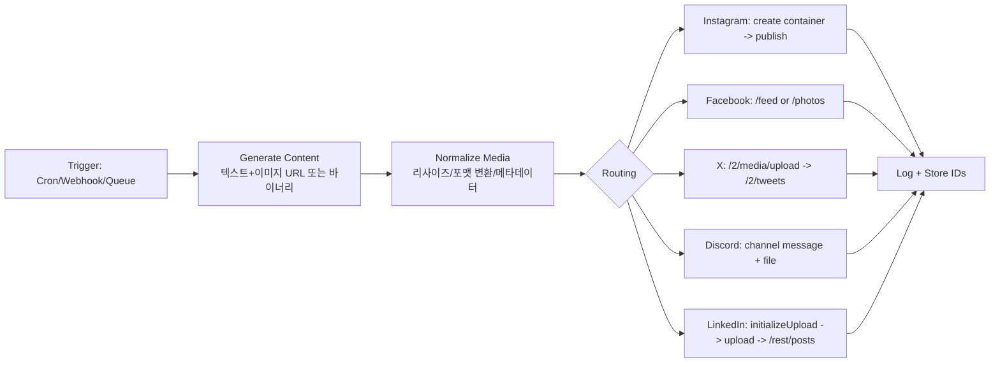

# SNS API로 이미지·글 자동 업로드 실무 튜토리얼 리서치 보고서

Executive summary: 본 보고서는 인스타그램, 페이스북, 트위터(X), 디스코드, 링크드인에 “이미지+텍스트”를 API로 자동 게시하는 방법을 **실무 관점에서 끝까지 구현 가능한 형태**로 정리한다. 플랫폼마다 **게시 가능한 계정 유형(예: 인스타 비즈니스/크리에이터), 인증 방식(OAuth2·봇 토큰 등), 미디어 업로드 방식(멀티파트 vs URL 기반), 승인/리뷰 필요 여부, 레이트 리밋·일일 한도**가 크게 달라 통합 자동화 설계 시 사전 분리가 필요하다. 특히 인스타그램(메타)과 링크드인은 **사전 승인(퍼미션/제품 액세스) · 계정 연결 요건**이 구현 성공을 좌우한다. n8n 기반 자동화는 X(공식 노드), 페이스북 Graph API(범용 노드), 디스코드(노드/HTTP), 링크드인(HTTP 또는 노드) 조합이 현실적이며, 토큰 보관·재시도·큐잉·감사로그를 포함한 아키텍처가 필수다.

## 범위와 공통 전제

이 보고서에서 “자동 업로드”는 **(1) 이미지 업로드(또는 이미지 URL 등록) → (2) 글/포스트 생성(게시)**의 최소 2단계를 의미한다. X·링크드인·디스코드는 **바이너리(멀티파트) 업로드**를 지원하거나(디스코드), **업로드용 별도 엔드포인트를 먼저 호출**하고(링크드인·X), 그 결과 ID(URN/media_id)를 **게시 생성 API에 연결**한다. citeturn14search1turn12view1turn13search2

메타(인스타/페북)는 구현 난이도가 “API 호출”보다 **계정 연결 요건과 권한(Scopes/Permissions) 승인**에서 급상승한다. 인스타그램 게시(Instagram Graph API Publishing)는 **프로페셔널(비즈니스/크리에이터) 계정**과 **페이스북 페이지 연결**이 사실상 전제이며, 권한 모델이 페이지/비즈니스 매니저 역할(Tasks)과 결합된다. citeturn8view0turn21search0

플랫폼별로 공식 문서 접근성/표현이 다르며, 인스타그램의 “일일 게시 한도(자동 게시)”는 **공식 고정 수치가 문서/시점/파트너 안내에서 상이하게 등장**한다(25/50/100 등). 따라서 본 보고서는 해당 항목을 **미지정**으로 두고, 대신 **(a) 공식/준공식 엔드포인트로 현재 사용량을 조회**하고 (b) 실제 에러 코드(2207042 등)를 기준으로 큐잉하는 설계를 권장한다. citeturn21search0turn22search1turn18search14turn20search3

## 플랫폼별 개발자 계정·앱 등록·키/토큰 발급 튜토리얼

아래는 “개발자 계정 생성 → 앱 등록 → 키/토큰 발급”의 **실제 작업 순서**를 플랫폼별로 정리한 것이다. (요청하신 “예시 스크린샷 링크”는 각 플랫폼 공식 문서/포털 URL을 우선 제공한다. 일부 URL은 문서 내 이미지(스크린샷) 섹션을 포함한다.)

### 인스타그램·페이스북(메타 Graph API)

핵심 개념: 인스타그램 “게시”는 메타 Graph API를 통해 이루어지며, **(1) 메타 개발자 앱 생성 → (2) 사용자/페이지 토큰 발급 → (3) 연결된 페이지에서 IG 프로 계정 ID 획득 → (4) 게시 API 호출** 흐름을 따른다. 메타 공식 Postman 컬렉션도 동일 전제를 명시한다. citeturn8view0turn8view1

필수 선행 조건(실무 체크):
- 인스타그램 계정이 **프로페셔널(비즈니스/크리에이터)** 이어야 하며, **페이스북 페이지에 연결**되어야 한다. citeturn8view0turn21search0
- 권한(permissions)은 최소 `pages_show_list`, `pages_read_engagement`, `instagram_basic`, `instagram_content_publish`가 흔히 필요하다(사용 시나리오에 따라 추가). citeturn8view0turn21search0
- 페이지에서 앱 사용자가 수행할 수 있는 Tasks(예: `MANAGE`/`CREATE_CONTENT`)가 요구될 수 있다. citeturn21search0

앱 생성/설정(요약 절차):
1) entity["company","Meta","parent company of facebook"] 개발자 대시보드에서 앱 생성 후 기본 설정(앱 이름/연락 이메일/개인정보처리방침 URL 등) 입력  
2) 앱을 개발 모드 → 라이브 모드로 전환(라이브 전환 시 필수 항목 누락 여부 확인)  
3) Graph API Explorer 또는 OAuth 로그인 플로우로 **User Access Token** 발급  
4) `/me/accounts`로 페이지 목록 및 **Page Access Token** 확보(해당 페이지에 연결된 `instagram_business_account` ID 확인) citeturn8view0turn8view1

예시 스크린샷/가이드 링크(공식 우선):
```text
(메타 앱 생성 가이드) https://developers.facebook.com/docs/development/create-an-app/
(Graph API Explorer 가이드) https://developers.facebook.com/docs/graph-api/guides/explorer/
(인스타그램 Graph API 개요) https://developers.facebook.com/docs/instagram-platform/overview/
```
(위 메타 개발자 문서 URL은 공식이며, 사용자가 브라우저로 접근 시 UI/캡처 이미지를 포함하는 섹션이 존재할 수 있다. 본 환경에서는 일부 메타 문서가 HTTP 429로 전문 열람이 제한되어, 가능한 범위에서 공식 Postman 문서·웹 아카이브를 병행 인용했다.) citeturn8view0turn6search13turn21search0

### 트위터(X)

X는 개발자 포털에서 **Project/App 생성** 후 OAuth2 설정을 통해 토큰을 발급한다. n8n도 동일 절차(클라이언트 ID/시크릿, 콜백 URL, read/write 권한 등)를 요구한다. citeturn26search3turn27search2

앱·토큰 발급 절차(실무):
1) 개발자 계정 생성 후 Developer Portal에서 Project/App 생성 citeturn27search2  
2) App의 “User authentication settings”에서 OAuth2 활성화, Redirect URL/Website URL 설정 citeturn26search3turn27search2  
3) OAuth2 권한(Scopes) 설정: 최소 `tweet.write`(게시), 미디어 업로드 포함 시 `media.write`, 사용자 정보 조회 시 `users.read`, 장기 운영이면 `offline.access`(리프레시 토큰 발급) citeturn14search2turn14search9turn14search6  
4) Authorization Code + PKCE로 user access token 발급(리프레시 토큰은 `offline.access` 포함 시 발급) citeturn14search2turn14search7

예시 스크린샷/가이드(공식):
```text
(X OAuth2 Authorization Code with PKCE) https://docs.x.com/fundamentals/authentication/oauth-2-0/authorization-code
(X Posts Quickstart: POST /2/tweets) https://docs.x.com/x-api/posts/manage-tweets/quickstart
(X Media Upload) https://docs.x.com/x-api/media/upload-media
```
citeturn14search2turn14search6turn14search9

### 디스코드

디스코드는 “소셜 게시”라기보다 **서버/채널에 메시지(텍스트+첨부 이미지)를 자동 전송**하는 모델이다. 가장 일반적인 방식은 **봇(Bot) 애플리케이션 생성 → 봇 토큰으로 채널 메시지 생성 API 호출**이다. citeturn13search3turn13search10

개발자/앱 생성 절차(공식 Quick Start 기반):
1) Developer Portal에서 앱 생성(Create App) citeturn13search3  
2) Bot 탭에서 “Reset Token”으로 봇 토큰 생성(재표시 불가하므로 안전 보관) citeturn13search3  
3) 필요 시 Privileged Gateway Intents 설정(메시지 전송만이면 보통 불필요하나, 기능 확장 시 필요) citeturn13search17  
4) OAuth2/Installation 설정으로 봇을 서버에 초대(권한 bitfield 포함) citeturn13search4

예시 스크린샷/가이드(공식):
```text
(Discord Getting Started - Creating an app & token screenshots 포함) https://docs.discord.com/developers/quick-start/getting-started
(Message Resource - files[n], payload_json 등) https://docs.discord.com/developers/resources/message
```
citeturn13search3turn13search10

### 링크드인

링크드인은 OAuth2 Authorization Code Flow(3-legged OAuth)가 기본이며, 앱은 Developer Portal에서 Client ID/Secret 및 Redirect URL을 설정한다. 또한 “scope는 앱이 어떤 Products/Partner Programs에 승인되었는지”에 따라 달라진다. citeturn12view0

토큰·권한 발급 절차(공식 흐름):
1) LinkedIn Developer Portal에서 앱 생성 및 Auth 탭에서 Client ID/Secret 확인 citeturn12view0  
2) Redirect URL(HTTPS, absolute URL, # 불가 등) 등록 citeturn12view0  
3) OAuth2 authorization endpoint로 사용자 동의 후 code 수신 → token endpoint로 access token 발급 citeturn12view0  
4) 게시(개인/조직) 권한: 실무에선 `w_member_social`(개인) 또는 `w_organization_social`(조직) 계열이 대표적이나, 실제 사용 가능 스코프는 Products 승인에 종속 citeturn12view0turn12view1

예시 스크린샷/가이드(공식):
```text
(LinkedIn 3-Legged OAuth Flow - 이미지: auth flow, Redirect URLs, OAuth Values 포함) https://learn.microsoft.com/en-us/linkedin/shared/authentication/authorization-code-flow
(Posts API - /rest/posts) https://learn.microsoft.com/en-us/linkedin/marketing/community-management/shares/posts-api
(Images API - /rest/images?action=initializeUpload) https://learn.microsoft.com/en-us/linkedin/marketing/community-management/shares/images-api
```
citeturn12view0turn12view1turn12view2

## 이미지 업로드·게시 API 레퍼런스

요청하신 대로 각 플랫폼별로 **엔드포인트 / 요청·응답 예시 / 파라미터 / 헤더 / 업로드 방식 / 미디어 제약**을 정리한다. (불명확한 값은 “미지정” 표기)

### 인스타그램 Graph API

인스타그램 게시의 핵심은 **IG Container 생성 → Publish** 모델이다. citeturn21search0turn22search1

엔드포인트
- (컨테이너 생성) `POST https://graph.facebook.com/v24.0/{ig-user-id}/media` citeturn21search0  
- (컨테이너 게시) `POST https://graph.facebook.com/v24.0/{ig-user-id}/media_publish` (creation_id 필요) citeturn6search12turn22search1  

요청 예시(이미지 컨테이너 생성: URL 기반)
```http
POST /v24.0/{ig-user-id}/media HTTP/1.1
Host: graph.facebook.com
Content-Type: application/x-www-form-urlencoded

image_url=https://cdn.example.com/image.jpg&
caption=Hello%20Instagram&
access_token={USER_ACCESS_TOKEN}
```
- 필수: `image_url`, `access_token` citeturn21search0  
- 선택(대표): `caption`(최대 2200자, 해시태그 30개, @태그 20개), `alt_text`(최대 1000자, 일부 타입만), `is_carousel_item` 등 citeturn21search0  
- 업로드 방식: **공개 URL을 인스타가 cURL로 가져감**(리다이렉트/인증/HTML 래퍼 링크는 실패 가능) citeturn22search1turn21search0  

응답 예시(컨테이너 ID)
```json
{ "id": "17889455560051444" }
```
citeturn21search0

게시 요청 예시
```http
POST /v24.0/{ig-user-id}/media_publish HTTP/1.1
Host: graph.facebook.com
Content-Type: application/x-www-form-urlencoded

creation_id=17889455560051444&
access_token={USER_ACCESS_TOKEN}
```

미디어 제약(공식/웹아카이브)
- 이미지: **JPEG**, 최대 **8MB**, 가로 320~1440(범위 밖은 스케일), 종횡비 **4:5 ~ 1.91:1**, 색공간 sRGB citeturn21search0  
- 캐러셀: children 최대 10개(이미지/비디오 혼합 가능; Reels는 캐러셀 불가) citeturn21search0  
- 컨테이너 만료: 24시간 citeturn21search0  

게시 한도/레이트 리밋
- Graph API/Instagram Graph API는 플랫폼/비즈니스 유스케이스 레이트 리밋이 있으며, 인스타 Graph API 호출은 “노출(Impressions)” 기반으로 계산된다는 공식 설명이 있다. citeturn21search1  
- “API로 게시 가능한 일일 포스트 수”는 문서/파트너 안내에서 25/50/100이 혼재하여 **미지정**으로 둔다(실무 대응은 429/2207042 처리로 큐잉). citeturn20search3turn18search14turn22search1  

### 페이스북 Pages(Graph API)

페이스북 페이지 게시 자동화는 보통 다음 중 하나다.
- 텍스트(링크 포함) 포스트: `/{page-id}/feed`  
- 사진 포스트: `/{page-id}/photos` (URL 또는 파일 업로드)  

n8n 템플릿 예시는 `POST https://graph.facebook.com/v24.0/{page-id}/feed`로 텍스트/스케줄 게시를 보여준다. citeturn11view2

엔드포인트(대표)
- 텍스트 포스트: `POST https://graph.facebook.com/v{version}/{page-id}/feed` citeturn11view2  
- 사진 포스트: `POST https://graph.facebook.com/v{version}/{page-id}/photos` (공식 레퍼런스는 본 환경에서 전문 열람이 제한되어, 요청 파라미터 상세는 **미지정**; 실무적으로는 `url` 또는 multipart `source` 사용이 일반적) citeturn0search0  

요청 예시(텍스트/예약 게시: n8n 템플릿 기반)
```http
POST /v24.0/{page-id}/feed HTTP/1.1
Host: graph.facebook.com
Content-Type: application/x-www-form-urlencoded

message=Hello%20Facebook&
published=false&
scheduled_publish_time=1710000000&
access_token={PAGE_ACCESS_TOKEN}
```
citeturn11view2

레이트 리밋/진단 헤더(공식+실무 관행)
- Graph API는 플랫폼 레이트 리밋/BUC 레이트 리밋이 적용되며, “실시간 사용량 통계는 응답 헤더로 제공”된다고 설명한다. citeturn21search1  
- 실무에서는 `X-App-Usage`, `X-Page-Usage` 같은 사용량 헤더를 모니터링한다(공식 문서 전문 인용은 제한되어 있어, 헤더명·형식은 커뮤니티 기반 자료로 보완). citeturn18search9turn18search11  

### 트위터(X) API

X는 **미디어 업로드 → media_id 획득 → POST 생성(/2/tweets)** 흐름이다. citeturn14search1turn14search6turn14search9

엔드포인트
- (미디어 업로드) `POST https://api.x.com/2/media/upload`  
  - body: `media`(파일), `media_category`(예: `tweet_image`), 선택 `media_type` 등 citeturn14search9turn14search1  
- (게시 생성) `POST https://api.x.com/2/tweets` citeturn14search6turn14search15  

요청 예시(미디어 업로드: multipart)
```http
POST /2/media/upload HTTP/1.1
Host: api.x.com
Authorization: Bearer {USER_ACCESS_TOKEN}
Content-Type: multipart/form-data; boundary=...

--...
Content-Disposition: form-data; name="media_category"
tweet_image
--...
Content-Disposition: form-data; name="media"; filename="pic.jpg"
Content-Type: image/jpeg

(binary)
--...--
```
citeturn14search9turn14search1

응답(개념)
- 성공 시 response body의 `data`에 업로드 결과가 담기며, 이후 `media_id`를 게시 생성에 넣는다. citeturn14search1turn14search9

게시 요청 예시
```http
POST /2/tweets HTTP/1.1
Host: api.x.com
Authorization: Bearer {USER_ACCESS_TOKEN}
Content-Type: application/json

{
  "text": "Hello from API",
  "media": { "media_ids": ["{media_id}"] }
}
```
citeturn14search6turn14search15turn14search1

미디어 제약(공식)
- 이미지 업로드 제한: **5MB**, GIF 15MB, 비디오 512MB(특정 카테고리) citeturn14search1turn14search3  
- 권장/지원 포맷: JPG/PNG/GIF/WEBP 등 citeturn14search3  

레이트 리밋/에러(공식)
- 엔드포인트별 rate limit, `x-rate-limit-*` 헤더로 확인, 초과 시 429 citeturn14search0turn14search10  
- `POST /2/tweets`는 “per app/per user” 한도가 표로 제공된다. citeturn14search0  

### 디스코드 API

디스코드는 채널 메시지 생성 API에 `files[n]`를 첨부하는 형태다. 공식 문서는 “파일 업로드 시 multipart/form-data + payload_json 사용”을 설명한다. citeturn13search2turn13search10

엔드포인트
- `POST https://discord.com/api/v10/channels/{channel.id}/messages` citeturn13search2turn13search10  

요청 예시(multipart + payload_json)
```http
POST /api/v10/channels/{channel_id}/messages HTTP/1.1
Host: discord.com
Authorization: Bot {BOT_TOKEN}
Content-Type: multipart/form-data; boundary=...

--...
Content-Disposition: form-data; name="payload_json"
Content-Type: application/json

{"content":"Hello Discord!","attachments":[{"id":0,"filename":"image.png"}]}
--...
Content-Disposition: form-data; name="files[0]"; filename="image.png"
Content-Type: image/png

(binary)
--...--
```
citeturn13search2turn13search10

파일/업로드 제한
- 파일 업로드는 기본 10MiB(사용자/서버 조건에 따라 상향), 200MiB(요청 상한) 초과 시 413 가능 citeturn13search2  
- 레이트 리밋은 라우트/글로벌 단위로 429를 반환(공식 Rate Limits 문서) citeturn0search8  

### 링크드인 API

링크드인은 “이미지 자산 업로드(Images API) → post 생성(Posts API)”의 2단계이며, post 생성 시 헤더 `X-Restli-Protocol-Version`, `Linkedin-Version`를 요구한다. citeturn12view1turn12view2

엔드포인트
- (이미지 업로드 초기화) `POST https://api.linkedin.com/rest/images?action=initializeUpload` citeturn12view2  
- (포스트 생성) `POST https://api.linkedin.com/rest/posts` citeturn12view1  

요청 예시(이미지 업로드 초기화)
```http
POST /rest/images?action=initializeUpload HTTP/1.1
Host: api.linkedin.com
Authorization: Bearer {ACCESS_TOKEN}
X-Restli-Protocol-Version: 2.0.0
Linkedin-Version: 202602
Content-Type: application/json

{
  "initializeUploadRequest": {
    "owner": "urn:li:organization:{orgId}"
  }
}
```
citeturn12view2turn12view1

게시 생성 예시(텍스트+이미지)
```http
POST /rest/posts HTTP/1.1
Host: api.linkedin.com
Authorization: Bearer {ACCESS_TOKEN}
X-Restli-Protocol-Version: 2.0.0
Linkedin-Version: 202602
Content-Type: application/json

{
  "author": "urn:li:organization:{orgId}",
  "commentary": "샘플 이미지 포스트",
  "visibility": "PUBLIC",
  "distribution": { "feedDistribution": "MAIN_FEED", "targetEntities": [], "thirdPartyDistributionChannels": [] },
  "content": { "media": { "id": "urn:li:image:{imageId}" } },
  "lifecycleState": "PUBLISHED",
  "isReshareDisabledByAuthor": false
}
```
(이미지 URN은 Images API 업로드 결과로 획득 후 연결) citeturn12view1turn12view2

에러/버전/레이트
- `429 Rate Limit` 발생 시 Developer Portal의 Usage & Limits 확인 및 과도 호출 제거 권고가 공식으로 명시되어 있으나, 구체 수치는 **미지정**이다. citeturn17view1turn17view2  
- 버전 헤더(`X-LinkedIn-Version` 계열) 디프리케이션 관련 426도 문서에 존재. citeturn17view1  

이미지 제약
- 이미지 픽셀 수 제한(36,152,320 pixels) 언급이 공식/준공식 및 다수 파트너 가이드에서 반복되며, Posts API도 Images API를 참조하도록 안내한다. citeturn12view1turn15search1turn15search0  
- 최대 파일 크기 등은 “미지정”(문서/상품 타입/업로드 경로에 따라 상이 가능)

## 인증 방식·토큰 갱신·승인(리뷰) 요구 사항

### 인스타그램·페이스북(메타)
- 인증: OAuth2 기반 Access Token(사용자/페이지/시스템 사용자). Instagram API with Facebook Login은 페이지 연결 및 권한 모델을 전제로 한다. citeturn8view0turn21search0  
- 토큰 갱신: (공식 접근 제한으로 상세 절차 일부 미지정) 실무에선 장기 운용을 위해 장기 토큰(롱리브드) 또는 시스템 사용자 토큰을 사용하며, 앱 리뷰(Advanced Access) 필요 가능성이 높다(특히 일반 사용자 대상). citeturn22search1turn21search0  
- 승인(리뷰): 퍼미션(예: `instagram_content_publish`)은 앱이 개발 모드/테스트 사용자 범위를 벗어나면 승인 요구 가능. citeturn22search1turn8view0  

### 트위터(X)
- 인증: OAuth2 Authorization Code + PKCE 권장. `offline.access` 포함 시 리프레시 토큰 발급 가능. citeturn14search2turn14search7  
- 토큰 갱신: `POST https://api.x.com/2/oauth2/token`에 `grant_type=refresh_token`으로 갱신. citeturn14search2  
- 비용/플랜: 2026년 기준 “Pay-per-usage(크레딧) 모델”이 공식 문서에 명시되어 있으며, 구독형(legacy Basic/Pro)도 존재할 수 있다. citeturn27search5turn27search0  

### 디스코드
- 인증: Bot Token(만료 없음)이 일반적. OAuth2는 사용자 동의형 앱에서 사용. citeturn13search3turn13search4  
- 검증: 봇이 많은 서버(예: 100+ 서버)에서 운영될 경우 검증(verification) 요구가 있을 수 있다. citeturn13search1turn13search16  

### 링크드인
- 인증: 3-legged OAuth(Authorization Code). Redirect URL 제약(HTTPS, absolute, # 불가 등)이 엄격. citeturn12view0  
- 토큰 갱신: 공식 문서는 만료/갱신을 언급(만료 시 refresh)하나, 실제 메커니즘은 제품/파트너 상태에 따라 달라질 수 있어 일부 **미지정**. citeturn17view1turn12view0  
- 승인: 사용 가능한 scope는 Products/Partner Programs 승인에 종속(즉, “앱이 어떤 제품 접근을 승인받았는지”가 핵심). citeturn12view0turn17view2  

## 게시 제한·레이트 리밋·정책·에러 코드 대응

이 섹션은 “자동화 운영”에서 가장 자주 터지는 문제를 **에러 코드 중심**으로 정리한다.

### 인스타그램(메타)
- 컨테이너 만료(24시간), 컨테이너 생성 한도(rolling 24h 내 400 컨테이너) 등 제약이 문서에 존재한다. citeturn21search0  
- 게시 실패 대표 에러(실무):
  - “media not ready”류: 컨테이너 처리 완료 전 publish 시 발생 → 상태 확인/재시도 필요(상태코드 FINISHED 등 모델은 2단계/비동기). citeturn19search4turn20search4  
  - “Content Publishing Limit”(subcode 2207042): 한도 초과 → 큐잉/시간 지연 citeturn20search3turn20search5  
  - “Application request limit reached” 또는 스팸 의심 차단: 콘텐츠/빈도/계정 신뢰도 영향 → 재시도 간격 확대 및 수동 확인 필요 citeturn20search3turn19search11  

### 페이스북(메타)
- Graph API는 플랫폼/BUC 레이트 리밋이 있으며, 초과 시 호출 실패. citeturn21search1  
- 커뮤니티 기반으로 널리 알려진 대응:
  - 429 또는 400+code 4/17/32 등 “요청 제한” 계열 → 응답 헤더 사용량을 기반으로 throttling citeturn24search6turn18search11  

### 트위터(X)
- 429 시 `x-rate-limit-reset` 기반 대기 후 재시도(공식). citeturn14search0turn14search10  
- POST /2/tweets는 per user/per app 한도가 표로 제공되므로, 자동화는 게시 빈도를 이 표 기준으로 제한한다. citeturn14search0  

### 디스코드
- 429(레이트 리밋) 발생 시 `Retry-After` 및 라우트/글로벌 제한을 준수해야 한다(공식 레이트 리밋 문서). citeturn0search8  
- 첨부 업로드 실패(413 등)는 파일 크기(기본 10MiB, 요청 상한 200MiB) 초과 가능성. citeturn13search2  

### 링크드인
- 401/403는 토큰/스코프 문제로 자주 발생하며, 429는 “resource level throttle limit” 안내 메시지와 함께 발생할 수 있다. 공식 문서가 “Usage & Limits 확인”을 명시하나 수치는 미지정. citeturn17view1turn17view2  

## 플랫폼별 동작 예제 코드

요청 조건: **각 플랫폼별로 Python과 Node.js 각각 최소 1개**를 제공한다. 아래 코드는 “동작 가능한 형태”를 목표로 하되, 실제 실행을 위해서는 테스트 계정/토큰/ID·공개 이미지 URL 등을 환경변수로 주입해야 한다.

### 인스타그램 Python (URL 기반 이미지 게시)

```python
import os, requests, time

GRAPH = "https://graph.facebook.com/v24.0"

IG_USER_ID = os.environ["IG_USER_ID"]
ACCESS_TOKEN = os.environ["IG_USER_ACCESS_TOKEN"]
IMAGE_URL = os.environ["PUBLIC_IMAGE_URL"]  # publicly accessible JPEG URL
CAPTION = os.environ.get("IG_CAPTION", "Hello Instagram via API!")

def post_instagram_image():
    # 1) Create container
    r = requests.post(
        f"{GRAPH}/{IG_USER_ID}/media",
        data={"image_url": IMAGE_URL, "caption": CAPTION, "access_token": ACCESS_TOKEN},
        timeout=30,
    )
    r.raise_for_status()
    container_id = r.json()["id"]

    # 2) Publish
    r2 = requests.post(
        f"{GRAPH}/{IG_USER_ID}/media_publish",
        data={"creation_id": container_id, "access_token": ACCESS_TOKEN},
        timeout=30,
    )
    if r2.status_code >= 400:
        # Typical errors: publishing limit / media not ready / permission missing
        raise RuntimeError(f"Publish failed: {r2.status_code} {r2.text}")

    media_id = r2.json()["id"]
    return media_id

if __name__ == "__main__":
    print("published:", post_instagram_image())
```

이 흐름(POST `/{ig-user-id}/media` → POST `/{ig-user-id}/media_publish`)은 공식(웹아카이브) 문서에 명시된 컨테이너 기반 게시 모델이다. citeturn21search0turn6search12

### 인스타그램 Node.js

```js
import axios from "axios";
import qs from "qs";

const GRAPH = "https://graph.facebook.com/v24.0";

const igUserId = process.env.IG_USER_ID;
const accessToken = process.env.IG_USER_ACCESS_TOKEN;
const imageUrl = process.env.PUBLIC_IMAGE_URL; // public JPEG URL
const caption = process.env.IG_CAPTION ?? "Hello Instagram via API!";

async function postInstagramImage() {
  // 1) Create container
  const createRes = await axios.post(
    `${GRAPH}/${igUserId}/media`,
    qs.stringify({ image_url: imageUrl, caption, access_token: accessToken }),
    { headers: { "Content-Type": "application/x-www-form-urlencoded" }, timeout: 30000 }
  );
  const containerId = createRes.data.id;

  // 2) Publish
  try {
    const publishRes = await axios.post(
      `${GRAPH}/${igUserId}/media_publish`,
      qs.stringify({ creation_id: containerId, access_token: accessToken }),
      { headers: { "Content-Type": "application/x-www-form-urlencoded" }, timeout: 30000 }
    );
    return publishRes.data.id;
  } catch (e) {
    const status = e?.response?.status;
    const body = e?.response?.data;
    // Handle: limit reached / permission issues / media not ready
    throw new Error(`IG publish error: ${status} ${JSON.stringify(body)}`);
  }
}

postInstagramImage().then(console.log).catch(console.error);
```

이미지 URL은 “인스타가 cURL로 가져갈 수 있는 공개 URL”이어야 하며, JPEG/8MB/종횡비 제약을 만족해야 한다. citeturn21search0turn22search1

### 페이스북 Python (페이지 텍스트/예약 게시 예시)

```python
import os, requests

GRAPH = "https://graph.facebook.com/v24.0"
PAGE_ID = os.environ["FB_PAGE_ID"]
PAGE_TOKEN = os.environ["FB_PAGE_ACCESS_TOKEN"]

def schedule_page_post(message: str, unix_time: int):
    # publish later: published=false + scheduled_publish_time
    r = requests.post(
        f"{GRAPH}/{PAGE_ID}/feed",
        data={
            "message": message,
            "published": "false",
            "scheduled_publish_time": str(unix_time),
            "access_token": PAGE_TOKEN,
        },
        timeout=30,
    )
    r.raise_for_status()
    return r.json()

if __name__ == "__main__":
    print(schedule_page_post("Hello Facebook (scheduled)!", 1710000000))
```

위 `/{page-id}/feed` 스케줄 게시 파라미터(`published=false`, `scheduled_publish_time`)는 n8n 공식 워크플로 템플릿 설명에 구체적으로 등장한다. citeturn11view2

### 페이스북 Node.js (텍스트 게시)

```js
import axios from "axios";
import qs from "qs";

const GRAPH = "https://graph.facebook.com/v24.0";
const pageId = process.env.FB_PAGE_ID;
const pageToken = process.env.FB_PAGE_ACCESS_TOKEN;

async function postToPage(message) {
  try {
    const res = await axios.post(
      `${GRAPH}/${pageId}/feed`,
      qs.stringify({ message, access_token: pageToken }),
      { headers: { "Content-Type": "application/x-www-form-urlencoded" }, timeout: 30000 }
    );
    return res.data; // includes post id
  } catch (e) {
    const status = e?.response?.status;
    const data = e?.response?.data;
    throw new Error(`FB post failed: ${status} ${JSON.stringify(data)}`);
  }
}

postToPage("Hello Facebook!").then(console.log).catch(console.error);
```

레이트 리밋은 Graph API의 플랫폼/BUC 정책을 따르며, 초과 시 요청 실패가 발생할 수 있다. citeturn21search1turn24search6

### 트위터(X) Python (미디어 업로드 + 포스트)

```python
import os, requests

X_API = "https://api.x.com"
TOKEN = os.environ["X_USER_ACCESS_TOKEN"]
IMAGE_PATH = os.environ["X_IMAGE_PATH"]  # local file path
TEXT = os.environ.get("X_TEXT", "Hello from X API + image!")

HEADERS = {"Authorization": f"Bearer {TOKEN}"}

def upload_media(image_path: str) -> str:
    with open(image_path, "rb") as f:
        files = {"media": (os.path.basename(image_path), f, "image/jpeg")}
        data = {"media_category": "tweet_image"}
        r = requests.post(f"{X_API}/2/media/upload", headers=HEADERS, files=files, data=data, timeout=60)
    r.raise_for_status()
    # NOTE: exact response shape may vary; treat as data-driven
    media_id = r.json()["data"]["id"]
    return media_id

def create_post(text: str, media_id: str) -> dict:
    payload = {"text": text, "media": {"media_ids": [media_id]}}
    r = requests.post(
        f"{X_API}/2/tweets",
        headers={**HEADERS, "Content-Type": "application/json"},
        json=payload,
        timeout=30,
    )
    if r.status_code == 429:
        # read x-rate-limit-reset, then sleep/backoff
        raise RuntimeError(f"Rate limited. headers={dict(r.headers)} body={r.text}")
    r.raise_for_status()
    return r.json()

if __name__ == "__main__":
    mid = upload_media(IMAGE_PATH)
    print(create_post(TEXT, mid))
```

미디어 업로드는 `/2/media/upload`에 `media`(파일)와 `media_category`가 필수이며, 게시 생성은 `POST /2/tweets`로 `media_ids`를 연결한다. citeturn14search9turn14search1turn14search15

### 트위터(X) Node.js

```js
import fs from "fs";
import axios from "axios";
import FormData from "form-data";

const X_API = "https://api.x.com";
const token = process.env.X_USER_ACCESS_TOKEN;
const imagePath = process.env.X_IMAGE_PATH;
const text = process.env.X_TEXT ?? "Hello from X API + image!";

const auth = { Authorization: `Bearer ${token}` };

async function uploadMedia(path) {
  const form = new FormData();
  form.append("media_category", "tweet_image");
  form.append("media", fs.createReadStream(path));

  const res = await axios.post(`${X_API}/2/media/upload`, form, {
    headers: { ...auth, ...form.getHeaders() },
    timeout: 60000,
  });
  return res.data.data.id;
}

async function createPost(mediaId) {
  try {
    const res = await axios.post(
      `${X_API}/2/tweets`,
      { text, media: { media_ids: [mediaId] } },
      { headers: { ...auth, "Content-Type": "application/json" }, timeout: 30000 }
    );
    return res.data;
  } catch (e) {
    const status = e?.response?.status;
    const hdr = e?.response?.headers;
    const body = e?.response?.data;
    if (status === 429) {
      throw new Error(`X rate limited. x-rate-limit-reset=${hdr?.["x-rate-limit-reset"]}`);
    }
    throw new Error(`X create post failed: ${status} ${JSON.stringify(body)}`);
  }
}

uploadMedia(imagePath).then(createPost).then(console.log).catch(console.error);
```

X의 레이트 리밋은 엔드포인트별로 다르며 `x-rate-limit-*` 헤더로 확인한다. citeturn14search0turn14search10turn14search9

### 디스코드 Python (채널에 텍스트+이미지 첨부)

```python
import os, requests, json

BOT_TOKEN = os.environ["DISCORD_BOT_TOKEN"]
CHANNEL_ID = os.environ["DISCORD_CHANNEL_ID"]
FILE_PATH = os.environ["DISCORD_IMAGE_PATH"]
CONTENT = os.environ.get("DISCORD_TEXT", "Hello Discord with image!")

url = f"https://discord.com/api/v10/channels/{CHANNEL_ID}/messages"
headers = {"Authorization": f"Bot {BOT_TOKEN}"}

payload_json = {"content": CONTENT, "attachments": [{"id": 0, "filename": os.path.basename(FILE_PATH)}]}

with open(FILE_PATH, "rb") as f:
    files = {
        "payload_json": (None, json.dumps(payload_json), "application/json"),
        "files[0]": (os.path.basename(FILE_PATH), f, "image/png"),
    }
    r = requests.post(url, headers=headers, files=files, timeout=30)

if r.status_code == 429:
    raise RuntimeError(f"Rate limited: {r.text}")
r.raise_for_status()
print(r.json())
```

`files[n]`와 `payload_json`을 사용하는 multipart 업로드 방식은 공식 문서에 명시되어 있다. citeturn13search2turn13search10

### 디스코드 Node.js

```js
import fs from "fs";
import axios from "axios";
import FormData from "form-data";

const botToken = process.env.DISCORD_BOT_TOKEN;
const channelId = process.env.DISCORD_CHANNEL_ID;
const filePath = process.env.DISCORD_IMAGE_PATH;
const content = process.env.DISCORD_TEXT ?? "Hello Discord with image!";

const url = `https://discord.com/api/v10/channels/${channelId}/messages`;

async function sendMessageWithFile() {
  const form = new FormData();
  const payload = {
    content,
    attachments: [{ id: 0, filename: "image.png" }],
  };

  form.append("payload_json", JSON.stringify(payload));
  form.append("files[0]", fs.createReadStream(filePath), "image.png");

  try {
    const res = await axios.post(url, form, {
      headers: { Authorization: `Bot ${botToken}`, ...form.getHeaders() },
      timeout: 30000,
    });
    return res.data;
  } catch (e) {
    const status = e?.response?.status;
    if (status === 429) {
      throw new Error(`Discord rate limited. retry_after(ms)=${e.response.data?.retry_after}`);
    }
    throw new Error(`Discord send failed: ${status} ${JSON.stringify(e?.response?.data)}`);
  }
}

sendMessageWithFile().then(console.log).catch(console.error);
```

### 링크드인 Python (이미지 업로드 초기화 → 업로드 → 포스트 생성)

```python
import os, requests

TOKEN = os.environ["LINKEDIN_ACCESS_TOKEN"]
OWNER_URN = os.environ["LINKEDIN_AUTHOR_URN"]  # e.g., urn:li:organization:123
LINKEDIN_VERSION = os.environ.get("LINKEDIN_VERSION", "202602")
IMAGE_PATH = os.environ["LINKEDIN_IMAGE_PATH"]
TEXT = os.environ.get("LINKEDIN_TEXT", "LinkedIn image post via API")

BASE = "https://api.linkedin.com"

common_headers = {
    "Authorization": f"Bearer {TOKEN}",
    "X-Restli-Protocol-Version": "2.0.0",
    "Linkedin-Version": LINKEDIN_VERSION,
}

# 1) initialize upload
init = requests.post(
    f"{BASE}/rest/images?action=initializeUpload",
    headers={**common_headers, "Content-Type": "application/json"},
    json={"initializeUploadRequest": {"owner": OWNER_URN}},
    timeout=30,
)
init.raise_for_status()
init_data = init.json()

# NOTE: response schema depends on LinkedIn; adapt to returned fields
upload_url = init_data["value"]["uploadUrl"]
image_urn = init_data["value"]["image"]

# 2) upload bytes (PUT to upload URL)
with open(IMAGE_PATH, "rb") as f:
    up = requests.put(upload_url, data=f, headers={"Content-Type": "application/octet-stream"}, timeout=60)
    up.raise_for_status()

# 3) create post (use image URN)
post = requests.post(
    f"{BASE}/rest/posts",
    headers={**common_headers, "Content-Type": "application/json"},
    json={
        "author": OWNER_URN,
        "commentary": TEXT,
        "visibility": "PUBLIC",
        "distribution": {"feedDistribution": "MAIN_FEED", "targetEntities": [], "thirdPartyDistributionChannels": []},
        "content": {"media": {"id": image_urn}},
        "lifecycleState": "PUBLISHED",
        "isReshareDisabledByAuthor": False,
    },
    timeout=30,
)
if post.status_code == 429:
    raise RuntimeError(f"LinkedIn rate limited: {post.text}")
post.raise_for_status()

print("Created. x-restli-id:", post.headers.get("x-restli-id"))
```

링크드인의 이미지는 Images API로 업로드 후(Post 생성에 필요) Posts API를 사용해 게시한다는 점이 공식 문서에 명시되어 있다. citeturn12view1turn12view2turn17view2

### 링크드인 Node.js

```js
import fs from "fs";
import axios from "axios";

const token = process.env.LINKEDIN_ACCESS_TOKEN;
const ownerUrn = process.env.LINKEDIN_AUTHOR_URN; // urn:li:organization:123
const version = process.env.LINKEDIN_VERSION ?? "202602";
const imagePath = process.env.LINKEDIN_IMAGE_PATH;
const text = process.env.LINKEDIN_TEXT ?? "LinkedIn image post via API";

const base = "https://api.linkedin.com";
const commonHeaders = {
  Authorization: `Bearer ${token}`,
  "X-Restli-Protocol-Version": "2.0.0",
  "Linkedin-Version": version,
};

async function initializeUpload() {
  const res = await axios.post(
    `${base}/rest/images?action=initializeUpload`,
    { initializeUploadRequest: { owner: ownerUrn } },
    { headers: { ...commonHeaders, "Content-Type": "application/json" }, timeout: 30000 }
  );
  return res.data;
}

async function uploadBytes(uploadUrl) {
  const stream = fs.createReadStream(imagePath);
  await axios.put(uploadUrl, stream, {
    headers: { "Content-Type": "application/octet-stream" },
    maxBodyLength: Infinity,
    timeout: 60000,
  });
}

async function createPost(imageUrn) {
  try {
    const res = await axios.post(
      `${base}/rest/posts`,
      {
        author: ownerUrn,
        commentary: text,
        visibility: "PUBLIC",
        distribution: { feedDistribution: "MAIN_FEED", targetEntities: [], thirdPartyDistributionChannels: [] },
        content: { media: { id: imageUrn } },
        lifecycleState: "PUBLISHED",
        isReshareDisabledByAuthor: false,
      },
      { headers: { ...commonHeaders, "Content-Type": "application/json" }, timeout: 30000 }
    );
    return { id: res.headers["x-restli-id"], status: res.status };
  } catch (e) {
    const status = e?.response?.status;
    if (status === 429) throw new Error("LinkedIn rate limited (429). Check Usage & Limits.");
    throw new Error(`LinkedIn post failed: ${status} ${JSON.stringify(e?.response?.data)}`);
  }
}

(async () => {
  const init = await initializeUpload();
  const uploadUrl = init.value.uploadUrl;
  const imageUrn = init.value.image;
  await uploadBytes(uploadUrl);
  console.log(await createPost(imageUrn));
})();
```

## n8n 워크플로우 튜토리얼

이 섹션은 “n8n에서 각 플랫폼별로 **OAuth/토큰 연결 → 파일 준비 → 게시**까지”를 현실적으로 구성하는 방법을 다룬다. 핵심 결론은 다음과 같다.

- X: n8n에 **공식 X 노드**가 있고 OAuth2 자격 증명이 공식 문서로 제공된다. citeturn26search0turn26search3  
- 페이스북/인스타: n8n의 **Facebook Graph API 노드**(범용)로 호출 가능. 다만 일부 케이스에서 “바이너리 직접 업로드”가 API 요구 파라미터와 충돌할 수 있어(예: image_url 요구) URL 기반 업로드가 안정적일 수 있다. citeturn26search2turn26search1turn21search0  
- 디스코드: Discord 노드 또는 HTTP Request로 multipart 전송. 파일 제한/429 대비는 필수. citeturn13search2turn0search8  
- 링크드인: 공식 노드가 있더라도 이미지 업로드 2단계(초기화→업로드→posts)가 필요해 HTTP Request 기반 구현이 흔하다(공식 API가 Restli 헤더 요구). citeturn12view1turn12view2turn17view2  

### 공통 워크플로 구조



### 플랫폼별 n8n 노드 설정 가이드

#### 페이스북 Graph API 노드(n8n)
- 노드: “Facebook Graph API node”는 host URL(기본 graph.facebook.com), Graph API 버전, Node/Edge를 파라미터로 받아 **임의의 Graph API 호출을 구성**한다. citeturn11view0turn26search2  
- 실무 예:  
  - 텍스트 포스트 → Node=`/{page-id}/feed` + POST  
  - 예약 게시 → `published=false`, `scheduled_publish_time` 포함(템플릿 참조) citeturn11view2turn26search2  
- 파일 업로드: “Send Binary File” 옵션이 있으나, API가 `image_url`을 요구하는 케이스에서는 URL 기반으로 전환 필요(이슈 사례). citeturn26search1turn21search0  

#### 인스타그램(메타) in n8n
- 전용 “Instagram 게시 노드”가 보편적으로 제공되기보다는, Facebook Graph API 노드/HTTP Request로 `/{ig-user-id}/media` → `/{ig-user-id}/media_publish`를 구성하는 방식이 안정적이다. citeturn21search0turn26search2  
- 파일 처리: 인스타는 `image_url`(공개 URL) 기반이므로, 워크플로 내에서 이미지를 생성/다운로드했다면 “공개로 서빙 가능한 URL”을 먼저 만들어야 한다. citeturn21search0turn22reddit23  

#### X 노드(n8n)
- n8n에는 “X (Formerly Twitter) node”가 있으며 Tweet 생성 등의 작업을 지원한다. citeturn26search0  
- OAuth2 연결은 “X credentials” 문서의 단계대로 진행(Callback URL, Read/Write 권한 등). citeturn26search3  
- 미디어 첨부는 노드 버전에 따라 별도 구현이 필요할 수 있어, 확실한 방법은 HTTP Request로 `/2/media/upload` 후 응답 media_id를 Tweet 생성에 주입하는 방식이다. citeturn14search9turn14search15turn26search0  

#### 디스코드 in n8n
- Discord 노드 또는 HTTP Request 노드로 구현 가능. 파일 첨부는 multipart/form-data 방식이므로 HTTP Request 노드에서 “Send Binary Data + payload_json” 패턴을 사용한다. citeturn13search2turn13search10  
- 429 처리: Discord는 레이트 리밋이 강하므로 Retry-After 기반 재시도가 필요. citeturn0search8  

#### 링크드인 in n8n
- 연결: OAuth2(Authorization Code). Redirect URL 제약 준수. citeturn12view0  
- 게시: Images API initializeUpload → 업로드 URL로 PUT → Posts API 호출로 구성(HTTP Request 노드 2~3개). citeturn12view2turn12view1  
- 429/버전: Linkedin-Version 디프리케이션 및 429 throttle은 공식 문서대로 처리. citeturn17view1turn17view2  

## 통합 자동화 설계: 보안·개인정보·정책 준수 체크리스트와 권장 아키텍처

자동 게시 시스템은 “API 호출 성공”보다 “운영 안정성/정책 준수”에서 실패하는 경우가 많다. 따라서 아키텍처는 **토큰 보관, 재시도, 큐잉, 로깅, 승인/리뷰 증빙**을 기본 기능으로 포함해야 한다.

권장 아키텍처(개념)
- **Token Vault**: OAuth 토큰/봇 토큰은 KMS로 암호화된 Secret Store에 저장(환경변수·DB 평문 금지).  
- **Queue 기반 게시**: 레이트 리밋/스팸 탐지 대응을 위해 “즉시 게시 요청”도 내부적으로 큐에 적재 후 워커가 속도 제한을 준수하며 처리.  
- **Idempotency Key**: 동일 콘텐츠가 중복 게시되지 않도록 (platform, account, content_hash, scheduled_time) 기반 멱등키 저장.  
- **Retry Policy**: 429/5xx는 지수 백오프 + jitter, 단 “플랫폼별 재시도 안전성” 고려(예: LinkedIn은 일부 요청이 비동기 처리될 수 있음). citeturn14search0turn17view2turn0search8  
- **Audit Log**: 요청/응답(민감정보 마스킹), 플랫폼 리턴 ID(게시물 ID/URN), 실패 사유(에러코드/서브코드) 저장.

정책·개인정보 체크리스트(핵심)
- 최소 권한 원칙: 필요한 scopes/permissions만 요청하고, 사용하지 않는 권한은 제거(특히 메타·링크드인). citeturn8view0turn12view0  
- 사용자 동의/고지: OAuth 동의 화면에서 요청 권한의 목적을 명확히 기술(링크드인은 scope 변경 시 재동의 필요를 명시). citeturn12view0  
- 콘텐츠 정책 준수: 스팸/조작/금지 콘텐츠는 게시 전에 내부 필터(금칙어/브랜드 안전/저작권) 적용.  
- 로그/저장 최소화: 토큰, 사용자 식별자, 업로드된 미디어의 원본을 장기간 저장해야 하는지 명확히 정의(필요 시 보관기간/삭제 정책 강제).  
- “우회” 금지: 브라우저 자동화/스크래핑 기반 게시(공식 API가 없는 기능을 억지로 구현)는 약관 위반 리스크가 크므로 대안 툴/공식 파트너를 우선 고려(특히 인스타/링크드인). citeturn21search1turn17view2  

## 플랫폼 비교 표와 대안

### 플랫폼별 비교표

| 플랫폼 | 발급 절차 난이도 | 인증 방식 | 미디어 업로드 방식 | 이미지 제약(대표) | 레이트 리밋/게시 한도 | n8n 지원 여부 | 비용/유료 제한 |
|---|---|---|---|---|---|---|---|
| 인스타그램 | 높음(계정 연결·권한 복잡) | OAuth2(User token 등) | **공개 URL 기반**(image_url) + 컨테이너 게시 | JPEG, 8MB, 4:5~1.91:1, sRGB citeturn21search0 | Graph/BUC 레이트 리밋 존재 citeturn21search1 / 일일 게시 한도: **미지정**(혼재) citeturn20search3turn18search14 | 전용 노드(게시) **미지정**, Graph API/HTTP로 구현 가능 citeturn26search2turn21search0 | API 자체는 무료(일반), 승인/리뷰 필요 가능(미지정) |
| 페이스북(페이지) | 중간 | OAuth2(Page token) | URL 또는 multipart(케이스별) | 미지정(게시 유형별 상이) | Graph API 레이트 리밋 존재 citeturn21search1 | Facebook Graph API 노드(공식) citeturn11view0turn26search2 | 대체로 무료(미지정) |
| 트위터(X) | 중간(포털·OAuth2) | OAuth2 PKCE(+refresh 가능) citeturn14search2 | `/2/media/upload`(multipart) → `/2/tweets` citeturn14search9turn14search15 | 이미지 5MB, GIF 15MB 등 citeturn14search1turn14search3 | 엔드포인트별 429, rate header 제공 citeturn14search0turn14search10 | X 노드(공식) + OAuth2 크리덴셜 문서 citeturn26search0turn26search3 | **Pay-per-usage(공식)** citeturn27search5 |
| 디스코드 | 낮음(봇 생성) | Bot token(일반) | 메시지 엔드포인트에 파일 첨부(multipart) citeturn13search2turn13search10 | 기본 10MiB(조건 따라 상향), 요청 상한 200MiB citeturn13search2 | 라우트/글로벌 레이트 리밋(429) citeturn0search8 | Discord 노드/HTTP로 가능(미지정) | 무료(일반), Nitro/Boost로 업로드 상향(미지정) |
| 링크드인 | 높음(제품/스코프 승인) | OAuth2(3-legged) citeturn12view0 | initializeUpload → PUT → /rest/posts citeturn12view2turn12view1 | 픽셀 36,152,320 제한(반복 언급) citeturn15search1turn12view1 | 429 throttle(수치 미지정) citeturn17view2 | LinkedIn credentials 문서(공식) + HTTP Request 권장 citeturn3search1turn12view2 | API 사용 비용: 미지정(대신 승인/파트너 요건이 장벽) citeturn12view0turn17view2 |

### 제약으로 인해 “우회”가 필요할 때의 권장 대안

공식 API 제약을 “우회(스크래핑/브라우저 자동화)”하는 것은 약관·계정 정지 위험이 크다. 따라서 다음 대안을 우선 고려한다.

- **공식 파트너형 소셜 퍼블리싱 툴**: entity["company","Buffer","social media management"] 같은 서비스는 각 SNS의 API 제약(파일 크기/포맷)을 감안해 변환/리사이즈·스케줄링을 제공하며, 업로드 성공률을 높이기 위한 내부 처리(리사이즈 등)를 안내한다. citeturn14search8turn15search12  
- **통합 게시 API 제공업체**: entity["company","Ayrshare","social media api platform"] 등은 여러 SNS에 대한 공통 API를 제공하되, 비용/정책/지원 범위는 별도 검토가 필요하다(플랫폼 정책 변화에 따라 제약). citeturn14search5turn15search1  
- **n8n + 공식 API 조합의 운영 안정화**: n8n 템플릿(멀티 플랫폼 소셜 자동화)이나 Graph API 노드 기반 워크플로로 자체 운영을 하되, URL 서빙(공개 URL), 큐잉, 재시도, 토큰 회전 등을 자체 구현한다. citeturn11view0turn26search0turn26search19  

“미지정”으로 남는 항목(특히 인스타그램 일일 게시 한도)은 플랫폼/버전/파트너 상태에 따라 달라질 수 있으므로, 실무에서는 **(1) 사용량 조회 엔드포인트 활용, (2) 429/2207042 등 에러 기반 큐잉, (3) 게시 간 최소 간격 강제**로 안정성을 확보하는 것이 가장 재현성이 높다. citeturn17view2turn14search0turn20search3turn21search0