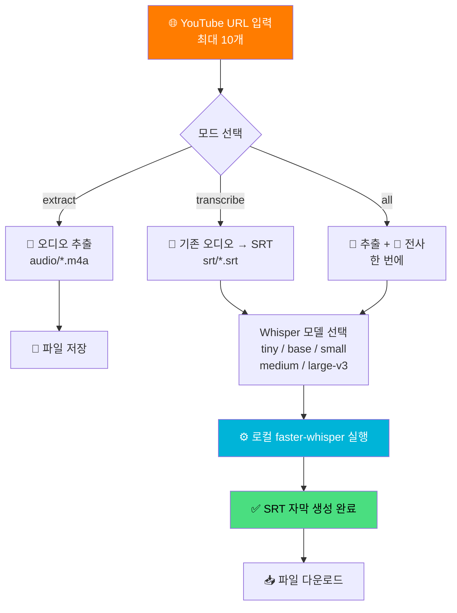
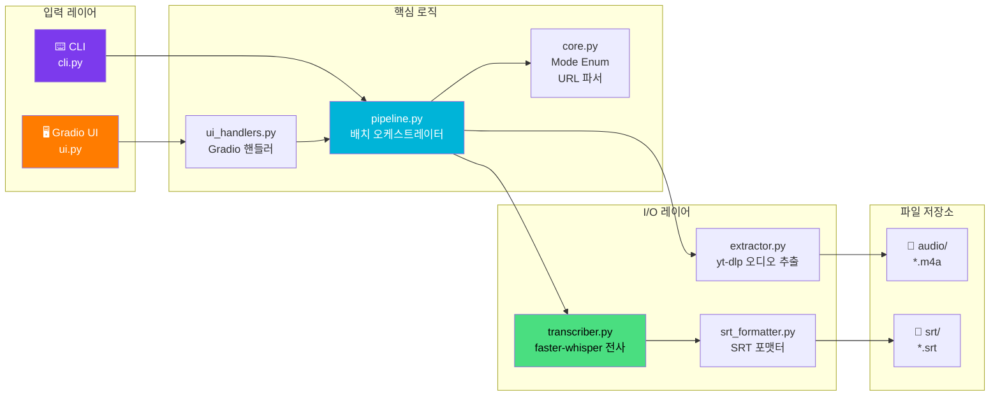
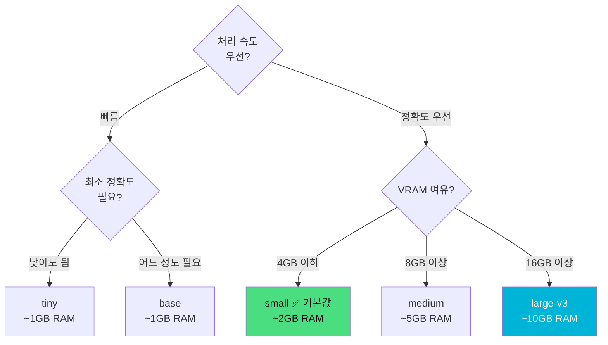

# 🎙️ YouTube to SRT - 로컬 AI 자막 생성기

<div align="center">

[](https://www.python.org)
[](https://gradio.app)
[](https://github.com/SYSTRAN/faster-whisper)
[](https://github.com/yt-dlp/yt-dlp)
[](https://github.com/astral-sh/uv)

> 🇺🇸 [English README](./README_EN.md)

**YouTube URL을 붙여넣으면 로컬 Whisper AI가 영어 SRT 자막을 뚝딱 만들어드립니다** ✨

[🎯 주요 기능](#-주요-기능) | [💻 로컬 실행](#-로컬에서-실행하기) | [🎮 사용 방법](#-사용-방법)

</div>

---

## 🎯 프로젝트 소개

**YouTube to SRT**는 YouTube URL을 최대 10개까지 입력하면 `yt-dlp`로 오디오를 다운로드하고, 로컬에서 동작하는 `faster-whisper`로 영어 SRT 자막을 자동 생성하는 도구입니다.

클라우드 API 비용 없이 Mac mini 등 로컬 머신에서 완전히 오프라인으로 실행됩니다. Gradio 기반의 웹 UI와 CLI 두 가지 방식으로 사용할 수 있습니다.

### ✨ 주요 기능

- 🌐 **URL 배치 처리** — 최대 10개 URL을 한 번에 처리
- 🎙️ **로컬 Whisper 전사** — `faster-whisper` 기반 오프라인 처리 (인터넷 불필요)
- 🖥️ **Gradio 웹 UI** — 브라우저에서 클릭 한 번으로 실행, 실시간 진행 상태 확인
- ⌨️ **CLI 지원** — 스크립트·자동화에 적합한 커맨드라인 인터페이스
- ⚡ **3가지 모드** — 음성 추출만 / SRT 전사만 / 둘 다 한번에
- 📦 **다중 Whisper 모델** — `tiny`부터 `large-v3`까지 정확도·속도 트레이드오프 선택
- 🔄 **중복 다운로드 방지** — 이미 추출된 오디오 파일은 재다운로드 없이 재사용
- 📥 **UI에서 직접 다운로드** — 생성된 SRT 파일 바로 다운로드

---

## 🎮 사용 방법



### 📝 단계별 가이드

**GUI 사용 (권장)**

| 단계 | 설명 |
|------|------|
| 1️⃣ 서버 시작 | `uv run youtube-to-srt-ui` 실행 후 `http://127.0.0.1:7860` 접속 |
| 2️⃣ URL 입력 | 텍스트박스에 YouTube URL을 한 줄에 하나씩 입력 (최대 10개) |
| 3️⃣ 옵션 설정 | 모드, Whisper 모델, 저장 폴더 선택 |
| 4️⃣ 실행 | 실행 버튼 클릭 → 우측 테이블에서 실시간 진행 상태 확인 |
| 5️⃣ 다운로드 | 완료 후 파일 다운로드 링크 클릭 |

**CLI 사용**

```bash
# 1) 음성만 추출 (기본) — audio/<video_id>.m4a 생성
uv run youtube-to-srt "https://www.youtube.com/watch?v=jNQXAC9IVRw"

# 2) 이미 추출된 오디오 파일을 SRT로 전사만
uv run youtube-to-srt --mode transcribe audio/jNQXAC9IVRw.m4a

# 3) 추출 + 전사 통합 실행
uv run youtube-to-srt --mode all "https://www.youtube.com/watch?v=jNQXAC9IVRw"

# 4) 파일에서 URL 목록 읽기 (# 주석, 빈 줄 자동 무시)
uv run youtube-to-srt --urls-file urls.example.txt
```

> ⚠️ `zsh`에서는 URL의 `?`와 `=` 때문에 반드시 따옴표로 감싸야 합니다.

---

## 🏗️ 기술 스택

<div align="center">

| 카테고리 | 기술 | 용도 |
|----------|------|------|
| UI | Gradio 4.0+ | 웹 인터페이스 |
| 오디오 추출 | yt-dlp | YouTube 오디오 다운로드 |
| 음성 인식 | faster-whisper | 로컬 Whisper AI 전사 |
| 패키지 관리 | uv | 빠른 Python 의존성 관리 |
| 테스트 | pytest | 단위·통합 테스트 |
| Python | 3.11 ~ 3.12 | 런타임 |

</div>

### 🎨 아키텍처



---

## 📁 프로젝트 구조

```
youtube-to-srt/
├── 📄 pyproject.toml          # 프로젝트 설정 및 의존성
├── 📄 .python-version         # Python 버전 고정
├── 📄 urls.example.txt        # URL 파일 예시
├── 📂 src/youtube_to_srt/
│   ├── 🔧 core.py             # Mode enum, URL 텍스트 파서 (공유 로직)
│   ├── 🖥️ ui.py               # Gradio Blocks 조립 및 진입점
│   ├── 🎛️ ui_handlers.py      # Gradio 무의존 순수 핸들러 (TDD 대상)
│   ├── ⌨️ cli.py              # CLI 인자 파싱 및 진입점
│   ├── 🎵 extractor.py        # yt-dlp 기반 오디오 추출
│   ├── 🎙️ transcriber.py      # faster-whisper 백엔드 + SRT 저장
│   ├── 📝 srt_formatter.py    # Segment → SRT 문자열 변환
│   └── 🔄 pipeline.py         # 배치 오케스트레이터
└── 📂 tests/
    ├── test_cli.py
    ├── test_core.py
    ├── test_extractor.py
    ├── test_transcriber.py
    ├── test_srt_formatter.py
    ├── test_pipeline.py
    ├── test_ui_handlers.py
    └── test_integration.py    # 실제 네트워크·Whisper 사용 (기본 비활성)
```

---

## 💻 로컬에서 실행하기

### 📋 사전 준비물

- Python 3.11 또는 3.12
- [uv](https://github.com/astral-sh/uv) 패키지 매니저

```bash
# uv 설치 (없는 경우)
curl -LsSf https://astral.sh/uv/install.sh | sh
```

### 🚀 실행 방법

```bash
# 1. 저장소 클론
git clone https://github.com/izowooi/creative-plate.git
cd creative-plate/youtube-to-srt

# 2. 의존성 설치
uv sync

# 3-a. Gradio UI 실행 (권장)
uv run youtube-to-srt-ui
# → 브라우저에서 http://127.0.0.1:7860 접속

# 3-b. CLI 실행
uv run youtube-to-srt --help
```

### ⚙️ 사용 가능한 옵션

| 옵션 | 기본값 | 설명 |
|------|--------|------|
| `--mode` | `extract` | `extract` / `transcribe` / `all` |
| `--audio-dir` | `audio/` | 추출된 오디오 저장 폴더 |
| `--srt-dir` | `srt/` | 생성된 SRT 저장 폴더 |
| `--model` | `small` | Whisper 모델 (`tiny`, `base`, `small`, `medium`, `large-v3`) |
| `--language` | `en` | 전사 언어 코드 |
| `--urls-file` | — | URL 목록 파일 경로 |

### 🧪 테스트 실행

```bash
# 단위 테스트만 (빠름, 네트워크 불필요)
uv run pytest

# 통합 테스트 포함 (실제 YouTube 다운로드 + Whisper 사용)
uv run pytest -m "integration or not integration"
```

---

## 🤖 Whisper 모델 선택 가이드



| 모델 | 속도 | 정확도 | VRAM |
|------|------|--------|------|
| `tiny` | ⚡⚡⚡⚡⚡ | ⭐⭐ | ~1 GB |
| `base` | ⚡⚡⚡⚡ | ⭐⭐⭐ | ~1 GB |
| `small` | ⚡⚡⚡ | ⭐⭐⭐⭐ | ~2 GB |
| `medium` | ⚡⚡ | ⭐⭐⭐⭐⭐ | ~5 GB |
| `large-v3` | ⚡ | ⭐⭐⭐⭐⭐ | ~10 GB |

---

## 🎯 향후 개선 사항

- [ ] **OpenAI Whisper API 백엔드** — 로컬 자원 없이 클라우드 전사 옵션 추가 (`--backend openai`)
- [ ] **다국어 지원** — 한국어, 일본어 등 언어 자동 감지
- [ ] **병렬 처리** — 여러 URL 동시 처리로 속도 향상
- [ ] **SRT 편집 UI** — 생성된 자막 인라인 편집
- [ ] **VTT / ASS 포맷** — SRT 외 자막 포맷 지원

---

## 🤝 기여하기

1. Fork 후 브랜치 생성
2. 변경사항 커밋 (`git commit -m 'feat: 새 기능 추가'`)
3. 브랜치 Push (`git push origin feature/새기능`)
4. Pull Request 생성

---

## 📄 라이선스

MIT License — 자유롭게 사용, 수정, 배포 가능합니다.

---

## 👨‍💻 만든 사람

**izowooi**

버그 리포트나 기능 제안은 [Issues](https://github.com/izowooi/creative-plate/issues)에 남겨주세요.

---

<div align="center">

**⭐ 이 프로젝트가 도움이 됐다면 Star를 눌러주세요! ⭐**

Made with ❤️ using faster-whisper + Gradio

</div>
