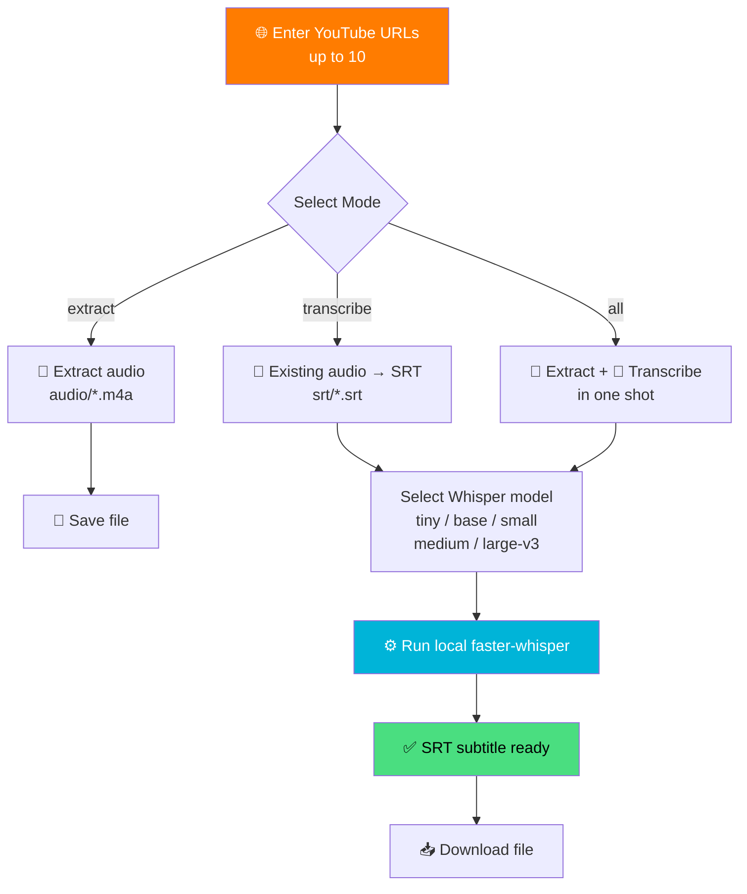
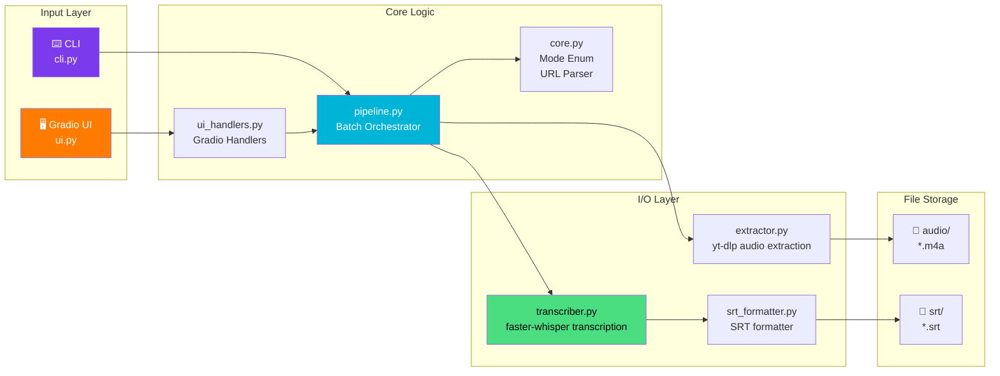
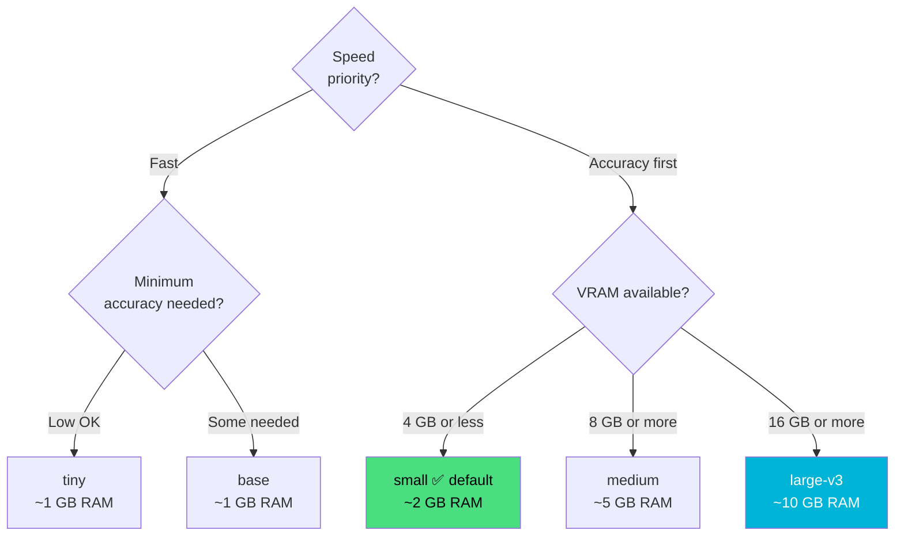

# 🎙️ YouTube to SRT - Local AI Subtitle Generator

> 🇰🇷 [한국어 README](./README.md)

<div align="center">

[](https://www.python.org)
[](https://gradio.app)
[](https://github.com/SYSTRAN/faster-whisper)
[](https://github.com/yt-dlp/yt-dlp)
[](https://github.com/astral-sh/uv)

**Paste a YouTube URL and let local Whisper AI generate English SRT subtitles instantly** ✨

[🎯 Features](#-features) | [💻 Getting Started](#-getting-started) | [🎮 How to Use](#-how-to-use)

</div>

---

## 🎯 Features

**YouTube to SRT** accepts up to 10 YouTube URLs, downloads audio via `yt-dlp`, and automatically generates English SRT subtitles using `faster-whisper` running entirely on your local machine.

No cloud API costs. Runs fully offline on a Mac mini or any local machine. Available as both a Gradio web UI and a CLI tool.

### ✨ Key Features

- 🌐 **Batch URL processing** — Handle up to 10 URLs in a single run
- 🎙️ **Local Whisper transcription** — Offline processing via `faster-whisper` (no internet required for transcription)
- 🖥️ **Gradio Web UI** — One-click operation in the browser with real-time progress tracking
- ⌨️ **CLI support** — Command-line interface suitable for scripting and automation
- ⚡ **3 operation modes** — Extract audio only / Transcribe existing audio / Both at once
- 📦 **Multiple Whisper models** — From `tiny` to `large-v3`, choose your speed vs. accuracy trade-off
- 🔄 **Skip duplicate downloads** — Already-extracted audio files are reused automatically
- 📥 **Direct UI download** — Download generated SRT files directly from the browser

---

## 🎮 How to Use



### 📝 Step-by-Step Guide

**GUI (Recommended)**

| Step | Description |
|------|-------------|
| 1️⃣ Start server | Run `uv run youtube-to-srt-ui`, then open `http://127.0.0.1:7860` |
| 2️⃣ Enter URLs | Paste YouTube URLs one per line (up to 10) |
| 3️⃣ Set options | Choose mode, Whisper model, and output folders |
| 4️⃣ Run | Click the Run button and watch real-time progress on the right |
| 5️⃣ Download | Click the download link once processing is complete |

**CLI Usage**

```bash
# 1) Extract audio only (default) — creates audio/<video_id>.m4a
uv run youtube-to-srt "https://www.youtube.com/watch?v=jNQXAC9IVRw"

# 2) Transcribe an existing audio file to SRT
uv run youtube-to-srt --mode transcribe audio/jNQXAC9IVRw.m4a

# 3) Extract + transcribe in one step
uv run youtube-to-srt --mode all "https://www.youtube.com/watch?v=jNQXAC9IVRw"

# 4) Read URLs from a file (# comments and blank lines are ignored)
uv run youtube-to-srt --urls-file urls.example.txt
```

> ⚠️ In `zsh`, always wrap URLs in quotes due to special characters `?` and `=`.

---

## 🏗️ Tech Stack

<div align="center">

| Category | Technology | Purpose |
|----------|-----------|---------|
| UI | Gradio 4.0+ | Web interface |
| Audio extraction | yt-dlp | YouTube audio download |
| Speech recognition | faster-whisper | Local Whisper AI transcription |
| Package manager | uv | Fast Python dependency management |
| Testing | pytest | Unit & integration tests |
| Python | 3.11 ~ 3.12 | Runtime |

</div>

### 🎨 Architecture



---

## 📁 Project Structure

```
youtube-to-srt/
├── 📄 pyproject.toml          # Project config and dependencies
├── 📄 .python-version         # Pinned Python version
├── 📄 urls.example.txt        # Example URL list file
├── 📂 src/youtube_to_srt/
│   ├── 🔧 core.py             # Mode enum, URL text parser (shared logic)
│   ├── 🖥️ ui.py               # Gradio Blocks assembly and entry point
│   ├── 🎛️ ui_handlers.py      # Pure Gradio-free handlers (TDD target)
│   ├── ⌨️ cli.py              # CLI argument parsing and entry point
│   ├── 🎵 extractor.py        # yt-dlp-based audio extraction
│   ├── 🎙️ transcriber.py      # faster-whisper backend + SRT writer
│   ├── 📝 srt_formatter.py    # Segment → SRT string converter
│   └── 🔄 pipeline.py         # Batch orchestrator
└── 📂 tests/
    ├── test_cli.py
    ├── test_core.py
    ├── test_extractor.py
    ├── test_transcriber.py
    ├── test_srt_formatter.py
    ├── test_pipeline.py
    ├── test_ui_handlers.py
    └── test_integration.py    # Real network + Whisper (disabled by default)
```

---

## 💻 Getting Started

### 📋 Prerequisites

- Python 3.11 or 3.12
- [uv](https://github.com/astral-sh/uv) package manager

```bash
# Install uv (if not already installed)
curl -LsSf https://astral.sh/uv/install.sh | sh
```

### 🚀 Running Locally

```bash
# 1. Clone the repository
git clone https://github.com/izowooi/creative-plate.git
cd creative-plate/youtube-to-srt

# 2. Install dependencies
uv sync

# 3-a. Launch Gradio UI (recommended)
uv run youtube-to-srt-ui
# → Open http://127.0.0.1:7860 in your browser

# 3-b. Use the CLI
uv run youtube-to-srt --help
```

### ⚙️ Available Options

| Option | Default | Description |
|--------|---------|-------------|
| `--mode` | `extract` | `extract` / `transcribe` / `all` |
| `--audio-dir` | `audio/` | Directory to save extracted audio |
| `--srt-dir` | `srt/` | Directory to save generated SRT files |
| `--model` | `small` | Whisper model (`tiny`, `base`, `small`, `medium`, `large-v3`) |
| `--language` | `en` | Transcription language code |
| `--urls-file` | — | Path to a file containing URLs |

### 🧪 Running Tests

```bash
# Unit tests only (fast, no network required)
uv run pytest

# Including integration tests (real YouTube download + Whisper)
uv run pytest -m "integration or not integration"
```

---

## 🤖 Whisper Model Selection Guide



| Model | Speed | Accuracy | VRAM |
|-------|-------|----------|------|
| `tiny` | ⚡⚡⚡⚡⚡ | ⭐⭐ | ~1 GB |
| `base` | ⚡⚡⚡⚡ | ⭐⭐⭐ | ~1 GB |
| `small` | ⚡⚡⚡ | ⭐⭐⭐⭐ | ~2 GB |
| `medium` | ⚡⚡ | ⭐⭐⭐⭐⭐ | ~5 GB |
| `large-v3` | ⚡ | ⭐⭐⭐⭐⭐ | ~10 GB |

---

## 🎯 Roadmap

- [ ] **OpenAI Whisper API backend** — Cloud transcription option without local resources (`--backend openai`)
- [ ] **Multi-language support** — Auto-detect Korean, Japanese, and more
- [ ] **Parallel processing** — Faster batch runs via concurrent URL handling
- [ ] **SRT editor UI** — Inline editing of generated subtitles
- [ ] **VTT / ASS format** — Additional subtitle format export

---

## 🤝 Contributing

1. Fork the repository and create a branch
2. Commit your changes (`git commit -m 'feat: add new feature'`)
3. Push to the branch (`git push origin feature/new-feature`)
4. Open a Pull Request

---

## 📄 License

MIT License — Free to use, modify, and distribute.

---

## 👨‍💻 Author

**izowooi**

For bug reports or feature requests, please open an [Issue](https://github.com/izowooi/creative-plate/issues).

---

<div align="center">

**⭐ If this project helped you, please give it a Star! ⭐**

Made with ❤️ using faster-whisper + Gradio

</div>
